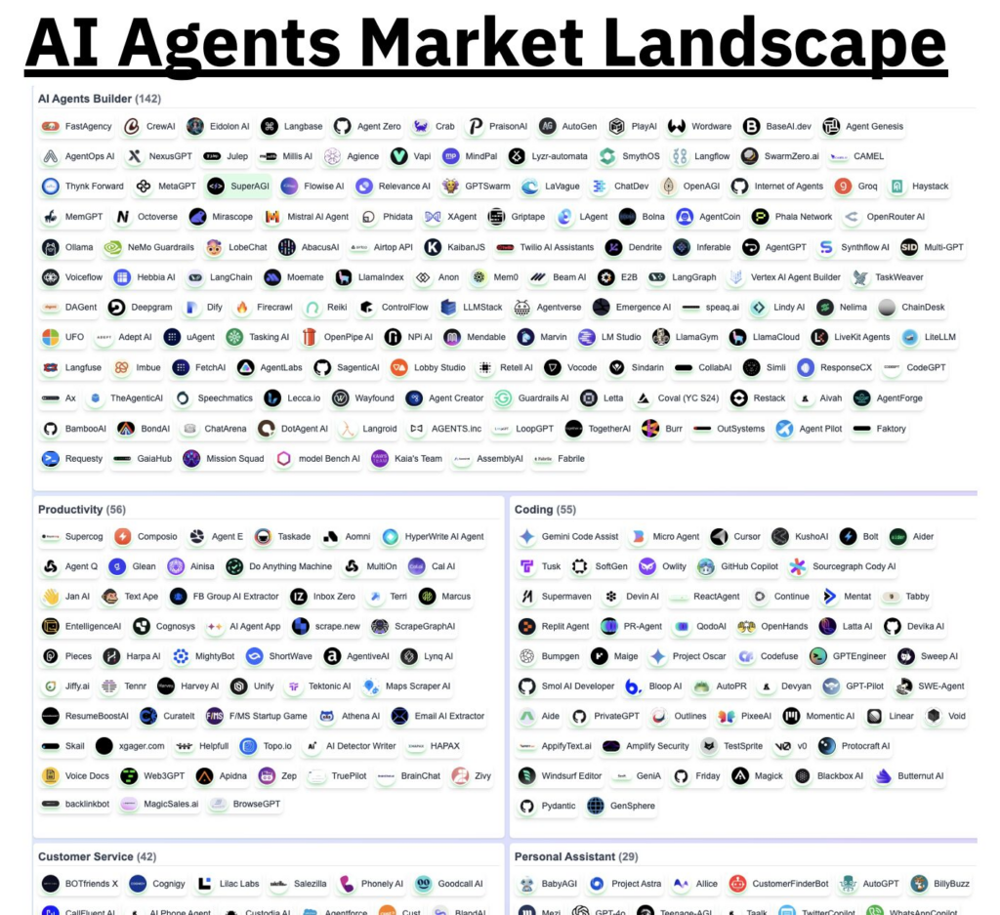
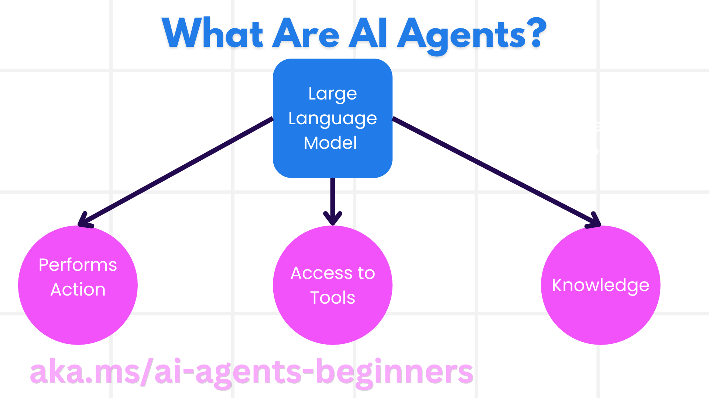
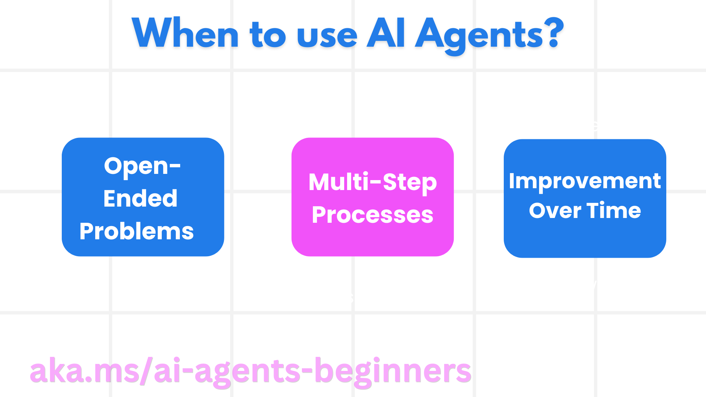
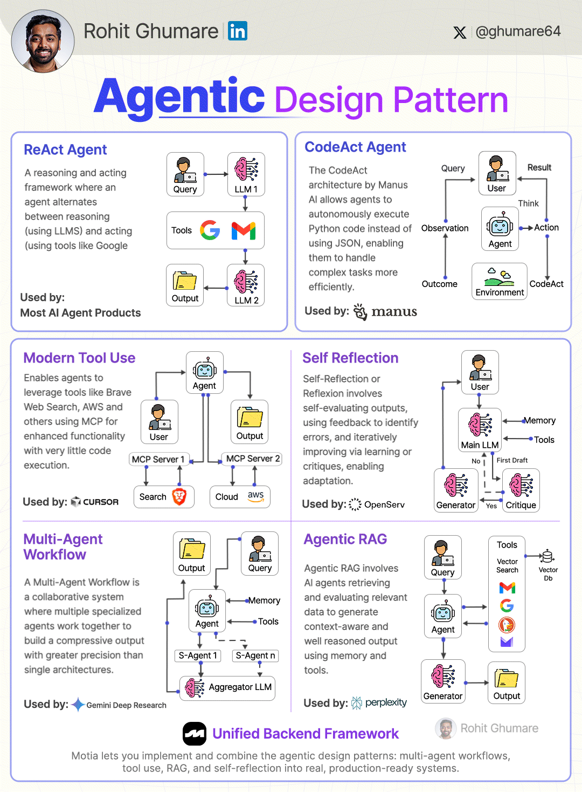

[[_TOC_]]


https://learn.microsoft.com/en-gb/semantic-kernel/frameworks/agent/?pivots=programming-language-python

# Installed below tools
    - pip install semantic-kernel
    - pip install openai
    - pip install python-dotenv


═╬═╬═╬═╬═╬═╬═╬═╬═╬═╬═╬═╬═╬═╬═╬═╬═╬═╬═╬═╬═╬═╬═╬═╬═╬═╬═╬═╬═╬═╬═╬═╬═╬═╬═╬═╬═╬═╬═╬═╬═╬═╬═╬═╬═╬═╬═╬═╬═╬═╬═╬═╬═╬═╬═

# Important things that you should consider while designing your AI agent:

- What’s the goal of this agent?
- How accurate or deterministic does it need to be?
- Does cost or fastness to get answers are relevant to you?
- What type of information are you expecting the model to excel at – is it code, content generation, OCR of existing documents, etc.
- Are you building one-shot prompts or a full multi-turn workflow?

- before piping it into the cloud, maybe run it past your security and data teams first.
- align your choice of LLM(s) with your application’s needs, Some agents can thrive with a single powerful model; others require orchestration between specialized ones.


> 1) Your are not sure yet and you want a swiss knife – OpenAI
Start with OpenAI’s GPT-4 Turbo or GPT-4o. These models are the go-to choice for agents that need to do stuff and not mess up while doing it. They’re good at reasoning, coding, and providing well context answers. But (of course) there’s a catch. They’re API-bound and the models are proprietary, which means you can’t pick under the hood, no tweaking or fine-tuning. 
And while OpenAI does offer enterprise-grade privacy guarantees, remember: by default, your data is still going out there.  If you’re working with anything proprietary, regulated, or just sensitive, double-check your legal and security teams are on board.
Also worth knowing: these models are generalists, which is both a gift and a curse. They’ll do pretty much anything, but sometimes in the most average way possible. Without detailed prompts, they can default to safe, bland, or boilerplate answers.
And lastly, brace your wallet!

> 2) If your agent needs to write code and crunch math – DeepSeek
If your agent will be heavily working in operations with dataframes, functions, or math-heavy tasks, DeepSeek is like hiring a math PhD who also happens to write Python! It’s optimized for reasoning and code generation, and often outperforms bigger names in structured thinking. And yes, it’s open-weight — more room for customization if you need it!

> 3) If you want thoughtful, careful answers and a model that feels like it’s double-checking the results that give you? – Anthropic
If GPT-4 is the fast-talking polymath, Claude is the one that thinks deeply before telling you anything, then proceeds to deliver something quietly insightful.
  Claude is trained to be careful, deliberate, and safe. It’s ideal for agents that need to reason ethically, review sensitive data, or generate reliable, well-structured responses with a calm tone.It’s also better at staying within bounds and understanding long, complex contexts. If your agent is making decisions or dealing with user data, Claude feels like it’s double-checking before replying, and I mean this in a good way!

> 4) If you want full control, local inference, and no cloud dependencies – Mistral
Mistral models are open-weight, fast, and surprisingly capable — ideal if you want full control or prefer running things on your own hardware. They’re lean by design, with minimal abstractions or baked-in behavior, giving you direct access to the model’s outputs and performance. You can run them locally and skip the per-token fees entirely, making them perfect for startups, hobbyists, or anyone tired of watching costs tick up by the word. While they may fall short on nuanced reasoning compared to GPT-4 or Claude, and require external tools for tasks like image processing, they offer privacy, flexibility, and customization without the overhead of managed services or locked-down APIs.

> 5) Mix-and-match
But, you don’t have to pick just one model! Depending on your agent’s architecture, you can mix and match to play to each model’s strengths. Use Claude for careful reasoning and nuanced responses, while offloading code generation to a local Mixtral instance to keep costs low. Smart routing between models lets you optimize for quality, speed, and budget.




═╬═╬═╬═╬═╬═╬═╬═╬═╬═╬═╬═╬═╬═╬═╬═╬═╬═╬═╬═╬═╬═╬═╬═╬═╬═╬═╬═╬═╬═╬═╬═╬═╬═╬═╬═╬═╬═╬═╬═╬═╬═╬═╬═╬═╬═╬═╬═╬═╬═╬═╬═╬═╬═╬═

# what you should consider if planning to deploy your agent to be used for production workflows

- **Infrastructure**: Before your agent can think, it needs somewhere to run. Most teams start with the usual cloud vendors (AWS, GCP and Azure), which offer the scale and flexibility needed for production workloads. If you’re rolling your own deployment, tools like FastAPI, vLLM, or Kubernetes will likely be in the mix. But if you’d rather skip DevOps, platforms like AgentsOps.a or Langfusei manage the hard parts for you. They handle deployment, scaling, and monitoring so you can focus on the agent’s logic.

- **Frameworks**: Once your agent is running, it needs logic! LangGraph is ideal if your agent needs structured reasoning or stateful workflows. For strict outputs and schema validation, Pydantic-AI lets you define exactly what the model should return, turning fuzzy text into clean Python objects. If you’re building multi-agent systems, CrewAI or AutoGen are the best choice as they let you coordinate multiple agents with defined roles and goals. Each framework brings a different lens: some focus on flow, others on structure or collaboration.

- **Security**: It’s the dull part most people skip — but agent auth and security matter. Tools like AgentAuth and Arcade AI help manage permissions, credentials, and safe execution. Even a personal agent that reads your email can have deep access to sensitive data. If it can act on your behalf, it should be treated like any other privileged system.

═╬═╬═╬═╬═╬═╬═╬═╬═╬═╬═╬═╬═╬═╬═╬═╬═╬═╬═╬═╬═╬═╬═╬═╬═╬═╬═╬═╬═╬═╬═╬═╬═╬═╬═╬═╬═╬═╬═╬═╬═╬═╬═╬═╬═╬═╬═╬═╬═╬═╬═╬═╬═╬═╬═

# Align Agent flow with application needs


## **Structure the task with planning and modular prompting:**
Instead of relying on a single prompt to solve complex tasks, break down the interaction using planning-based methods:

- **Chain-of-Thought (CoT) prompting**: Force the model to think step-by-step (Wei et al., 2022). Helps reduce logical leaps and increases transparency.
- **ReAct**: Combines reasoning and acting (Yao et al., 2022), allowing the agent to alternate between internal reasoning and external tool usage.
- **Program-Aided Language Models (PAL)**: Use the LLM to generate executable code (often Python) for solving tasks rather than freeform output (Gao et al., 2022).
- **Toolformer**: Automatically augments the agent with external tool calls where reasoning alone is insufficient (Shick et al., 2023).


## Enforce your output structure
LLM’s are flexible systems, with the ability to express in Natural Language, but, there’s a chance that your system isn’t.

Leveraging schema enforcing tactics is important to ensure that your outcomes are compatible with the existing systems and integrations.

Some of the AI agents frameworks, like Pydantic AI, already let you define response schemas in code and validate against them in real time.


## Plan failure handling ahead
Failures are inevitable, after all we are dealing with probabilistic systems. Plan for hallucinations, irrelevant completions or lack of compliance with your objectives:

- Add retry strategies for malformed or incomplete outputs.
- Use Guardrails AI or custom validators to intercept and reject invalid generations.
- Implement fallback prompts, backup models, or even human-in-the-loop escalation for critical flows.

A reliable AI agent does not only depend on how good the model is or how accurate the training data was, in the end it’s the outcome of deliberate systems engineering, relying on strong assumptions about data, structure, and control!

═╬═╬═╬═╬═╬═╬═╬═╬═╬═╬═╬═╬═╬═╬═╬═╬═╬═╬═╬═╬═╬═╬═╬═╬═╬═╬═╬═╬═╬═╬═╬═╬═╬═╬═╬═╬═╬═╬═╬═╬═╬═╬═╬═╬═╬═╬═╬═╬═╬═╬═╬═╬═╬═╬═

# What are AI Agents?

AI Agents are **systems** that enable **Large Language Models(LLMs)** to **perform actions** by extending their capabilities by giving LLMs **access to tools** and **knowledge**.

Let's break this definition into smaller parts:

- **System** - It's important to think about agents not as just a single component but as a system of many components. At the basic level, the components of an AI Agent are:
  - **Environment** - The defined space where the AI Agent is operating. For example, if we had a travel booking AI Agent, the environment could be the travel booking system that the AI Agent uses to complete tasks.
  - **Sensors** - Environments have information and provide feedback. AI Agents use sensors to gather and interpret this information about the current state of the environment. In the Travel Booking Agent example, the travel booking system can provide information such as hotel availability or flight prices.
  - **Actuators** - Once the AI Agent receives the current state of the environment, for the current task the agent determines what action to perform to change the environment. For the travel booking agent, it might be to book an available room for the user.





**Large Language Models** - The concept of agents existed before the creation of LLMs. The advantage of building AI Agents with LLMs is their ability to interpret human language and data. This ability enables LLMs to interpret environmental information and define a plan to change the environment.

**Perform Actions** - Outside of AI Agent systems, LLMs are limited to situations where the action is generating content or information based on a user's prompt. Inside AI Agent systems, LLMs can accomplish tasks by interpreting the user's request and using tools that are available in their environment.

**Access To Tools** - What tools the LLM has access to is defined by 1) the environment it's operating in and 2) the developer of the AI Agent. For our travel agent example, the agent's tools are limited by the operations available in the booking system, and/or the developer can limit the agent's tool access to flights.

**Memory+Knowledge** - Memory can be short-term in the context of the conversation between the user and the agent. Long-term, outside of the information provided by the environment, AI Agents can also retrieve knowledge from other systems, services, tools, and even other agents. In the travel agent example, this knowledge could be the information on the user's travel preferences located in a customer database.

═╬═╬═╬═╬═╬═╬═╬═╬═╬═╬═╬═╬═╬═╬═╬═╬═╬═╬═╬═╬═╬═╬═╬═╬═╬═╬═╬═╬═╬═╬═╬═╬═╬═╬═╬═╬═╬═╬═╬═╬═╬═╬═╬═╬═╬═╬═╬═╬═╬═╬═╬═╬═╬═╬═


# The different types of agents

Now that we have a general definition of AI Agents, let us look at some specific agent types and how they would be applied to a travel booking AI agent.

| **Agent Type**                | **Description**                                                                                                                       | **Example**                                                                                                                                                                                                                   |
| ----------------------------- | ------------------------------------------------------------------------------------------------------------------------------------- | ----------------------------------------------------------------------------------------------------------------------------------------------------------------------------------------------------------------------------- |
| **Simple Reflex Agents**      | Perform immediate actions based on predefined rules.                                                                                  | Travel agent interprets the context of the email and forwards travel complaints to customer service.                                                                                                                          |
| **Model-Based Reflex Agents** | Perform actions based on a model of the world and changes to that model.                                                              | Travel agent prioritizes routes with significant price changes based on access to historical pricing data.                                                                                                             |
| **Goal-Based Agents**         | Create plans to achieve specific goals by interpreting the goal and determining actions to reach it.                                  | Travel agent books a journey by determining necessary travel arrangements (car, public transit, flights) from the current location to the destination.                                                                                |
| **Utility-Based Agents**      | Consider preferences and weigh tradeoffs numerically to determine how to achieve goals.                                               | Travel agent maximizes utility by weighing convenience vs. cost when booking travel.                                                                                                                                          |
| **Learning Agents**           | Improve over time by responding to feedback and adjusting actions accordingly.                                                        | Travel agent improves by using customer feedback from post-trip surveys to make adjustments to future bookings.                                                                                                               |
| **Hierarchical Agents**       | Feature multiple agents in a tiered system, with higher-level agents breaking tasks into subtasks for lower-level agents to complete. | Travel agent cancels a trip by dividing the task into subtasks (for example, canceling specific bookings) and having lower-level agents complete them, reporting back to the higher-level agent.                                     |
| **Multi-Agent Systems (MAS)** | Agents complete tasks independently, either cooperatively or competitively.                                                           | Cooperative: Multiple agents book specific travel services such as hotels, flights, and entertainment. Competitive: Multiple agents manage and compete over a shared hotel booking calendar to book customers into the hotel. |

═╬═╬═╬═╬═╬═╬═╬═╬═╬═╬═╬═╬═╬═╬═╬═╬═╬═╬═╬═╬═╬═╬═╬═╬═╬═╬═╬═╬═╬═╬═╬═╬═╬═╬═╬═╬═╬═╬═╬═╬═╬═╬═╬═╬═╬═╬═╬═╬═╬═╬═╬═╬═╬═╬═

# When to Use AI Agents

In the earlier section, we used the Travel Agent use-case to explain how the different types of agents can be used in different scenarios of travel booking. We will continue to use this application throughout the course.

Let's look at the types of use cases that AI Agents are best used for:





- **Open-Ended Problems** - allowing the LLM to determine needed steps to complete a task because it can't always be hardcoded into a workflow.
- **Multi-Step Processes** - tasks that require a level of complexity in which the AI Agent needs to use tools or information over multiple turns instead of single shot retrieval.  
- **Improvement Over Time** - tasks where the agent can improve over time by receiving feedback from either its environment or users in order to provide better utility.

We cover more considerations of using AI Agents in the Building Trustworthy AI Agents lesson.

## Basics of Agentic Solutions

## Agent Development

The first step in designing an AI Agent system is to define the tools, actions, and behaviors. In this course, we focus on using the **Azure AI Agent Service** to define our Agents. It offers features like:

- Selection of Open Models such as OpenAI, Mistral, and Llama
- Use of Licensed Data through providers such as Tripadvisor
- Use of standardized OpenAPI 3.0 tools

## Agentic Patterns

Communication with LLMs is through prompts. Given the semi-autonomous nature of AI Agents, it isn't always possible or required to manually reprompt the LLM after a change in the environment. We use **Agentic Patterns** that allow us to prompt the LLM over multiple steps in a more scalable way.

This course is divided into some of the current popular Agentic patterns.

## Agentic Frameworks

Agentic Frameworks allow developers to implement agentic patterns through code. These frameworks offer templates, plugins, and tools for better AI Agent collaboration. These benefits provide abilities for better observability and troubleshooting of AI Agent systems.

═╬═╬═╬═╬═╬═╬═╬═╬═╬═╬═╬═╬═╬═╬═╬═╬═╬═╬═╬═╬═╬═╬═╬═╬═╬═╬═╬═╬═╬═╬═╬═╬═╬═╬═╬═╬═╬═╬═╬═╬═╬═╬═╬═╬═╬═╬═╬═╬═╬═╬═╬═╬═╬═╬═

# What problems do AI agents solve?

    AI agents offers several advantages for application development, particularly by enabling the creation of modular AI components that are able to collaborate to reduce manual intervention in complex tasks. AI agents can operate autonomously or semi-autonomously, making them powerful tools for a range of applications.

    Here are some of the key benefits:

    - **Modular Components:** Allows developers to define various types of agents for specific tasks (e.g., data scraping, API interaction, or natural language processing). This makes it easier to adapt the application as requirements evolve or new technologies emerge.

    - **Collaboration:** Multiple agents may "collaborate" on tasks. For example, one agent might handle data collection while another analyzes it and yet another uses the results to make decisions, creating a more sophisticated system with distributed intelligence.

    - **Human-Agent Collaboration:** Human-in-the-loop interactions allow agents to work alongside humans to augment decision-making processes. For instance, agents might prepare data analyses that humans can review and fine-tune, thus improving productivity.

    - **Process Orchestration:** Agents can coordinate different tasks across systems, tools, and APIs, helping to automate end-to-end processes like application deployments, cloud orchestration, or even creative processes like writing and design.

═╬═╬═╬═╬═╬═╬═╬═╬═╬═╬═╬═╬═╬═╬═╬═╬═╬═╬═╬═╬═╬═╬═╬═╬═╬═╬═╬═╬═╬═╬═╬═╬═╬═╬═╬═╬═╬═╬═╬═╬═╬═╬═╬═╬═╬═╬═╬═╬═╬═╬═╬═╬═╬═╬═

# AI Agent Frameworks

    AI agent frameworks are software platforms designed to simplify the creation, deployment, and management of AI agents. These frameworks provide developers with pre-built components, abstractions, and tools that streamline the development of complex AI systems.

    These frameworks help developers focus on the unique aspects of their applications by providing standardized approaches to common challenges in AI agent development. They enhance scalability, accessibility, and efficiency in building AI systems.


═╬═╬═╬═╬═╬═╬═╬═╬═╬═╬═╬═╬═╬═╬═╬═╬═╬═╬═╬═╬═╬═╬═╬═╬═╬═╬═╬═╬═╬═╬═╬═╬═╬═╬═╬═╬═╬═╬═╬═╬═╬═╬═╬═╬═╬═╬═╬═╬═╬═╬═╬═╬═╬═╬═

# What are AI Agent Frameworks and what do they enable developers to do?

    Traditional AI Frameworks can help you integrate AI into your apps and make these apps better in the following ways:

    Personalization: AI can analyze user behavior and preferences to provide personalized recommendations, content, and experiences. Example: Streaming services like Netflix use AI to suggest movies and shows based on viewing history, enhancing user engagement and satisfaction.

    Automation and Efficiency: AI can automate repetitive tasks, streamline workflows, and improve operational efficiency. Example: Customer service apps use AI-powered chatbots to handle common inquiries, reducing response times and freeing up human agents for more complex issues.

    Enhanced User Experience: AI can improve the overall user experience by providing intelligent features such as voice recognition, natural language processing, and predictive text. Example: Virtual assistants like Siri and Google Assistant use AI to understand and respond to voice commands, making it easier for users to interact with their devices.

That all sounds great right, so why do we need the AI Agent Framework?

AI Agent frameworks represent something more than just AI frameworks. They are designed to enable the creation of intelligent agents that can interact with users, other agents, and the environment to achieve specific goals. These agents can exhibit autonomous behavior, make decisions, and adapt to changing conditions. Let's look at some key capabilities enabled by AI Agent Frameworks:

- **Agent Collaboration and Coordination:** Enable the creation of multiple AI agents that can work together, communicate, and coordinate to solve complex tasks.

- **Task Automation and Management:** Provide mechanisms for automating multi-step workflows, task delegation, and dynamic task management among agents.

- **Contextual Understanding and Adaptation:** Equip agents with the ability to understand context, adapt to changing environments, and make decisions based on real-time information.

So in summary, agents allow you to do more, to take automation to the next level, to create more intelligent systems that can adapt and learn from their environment.

═╬═╬═╬═╬═╬═╬═╬═╬═╬═╬═╬═╬═╬═╬═╬═╬═╬═╬═╬═╬═╬═╬═╬═╬═╬═╬═╬═╬═╬═╬═╬═╬═╬═╬═╬═╬═╬═╬═╬═╬═╬═╬═╬═╬═╬═╬═╬═╬═╬═╬═╬═╬═╬═╬═

# How to quickly prototype, iterate, and improve the agent’s capabilities?

This is a fast-moving landscape, but there are some things that are common across most AI Agent Frameworks that can help you quickly prototype and iterate namely module components, collaborative tools, and real-time learning. Let's dive into these:

  - Use Modular Components: AI SDKs offer pre-built components such as AI and Memory connectors, function calling using natural language or code plugins, prompt templates, and more.
    
  - Leverage Collaborative Tools: Design agents with specific roles and tasks, enabling them to test and refine collaborative workflows.
    
  - Learn in Real-Time: Implement feedback loops where agents learn from interactions and adjust their behavior dynamically.

**Use Modular Components**
SDKs like Microsoft Semantic Kernel and LangChain offer pre-built components such as AI connectors, prompt templates, and memory management.

**How teams can use these:** Teams can quickly assemble these components to create a functional prototype without starting from scratch, allowing for rapid experimentation and iteration.

**How it works in practice:** You can use a pre-built parser to extract information from user input, a memory module to store and retrieve data, and a prompt generator to interact with users, all without having to build these components from scratch.


═╬═╬═╬═╬═╬═╬═╬═╬═╬═╬═╬═╬═╬═╬═╬═╬═╬═╬═╬═╬═╬═╬═╬═╬═╬═╬═╬═╬═╬═╬═╬═╬═╬═╬═╬═╬═╬═╬═╬═╬═╬═╬═╬═╬═╬═╬═╬═╬═╬═╬═╬═╬═╬═╬═

# What is an Agentic Design Pattern?

 An Agentic Design Pattern refers to a reusable structure or behavior pattern for building intelligent agents or agent-based systems. These patterns define how agents think, act, reason, collaborate, or reflect, rather than just what they do.

| **Aspect**          | **React Agent**                                     | **CodeAct Agent**                                          | **Modern Tool Use**                                          | **Self-Reflection**                                  | **Multi-Agent Workflow**                                        | **Agentic RAG**                                               |
| ------------------- | --------------------------------------------------- | ---------------------------------------------------------- | ------------------------------------------------------------ | ---------------------------------------------------- | --------------------------------------------------------------- | ------------------------------------------------------------- |
| **Definition**      | Agent that selects and executes actions dynamically | Agent that takes **code-level actions** using APIs or code | Leveraging advanced tools & frameworks for building systems  | Agent evaluates and improves its **own outputs**     | Multiple agents working together to complete a task             | Retrieval-Augmented Generation with **agent-like reasoning**  |
| **Core Idea**       | Decision-making from a list of tools/actions        | Executes code directly to affect the environment           | Using AI-native tools (LangChain, VSCode, GitHub, etc.)      | Loop of thinking, reviewing, correcting              | Agent collaboration and task orchestration                      | Smarter info retrieval + generation via iterative agent steps |
| **Typical Tools**   | LangChain, ReAct (paper), LangGraph                 | AutoGen, CrewAI, LLMCompiler                               | GitHub Copilot, Docker, LangChain, HuggingFace, VSCode       | Reflexion, DEPS, AutoGPT-style frameworks            | CrewAI, LangGraph, AutoGen                                      | LangChain + agents + tools (e.g., search, code exec)          |
| **Input Handling**  | Interprets query → chooses next action              | Interprets query → writes/modifies code                    | User/developer integrates tools to assist dev or model tasks | Takes prior output → critiques/improves → re-attempt | Each agent gets sub-tasks or goals from the others              | Queries data sources, reflects, re-queries                    |
| **Autonomy Level**  | Medium – needs structured action space              | High – executes low-level instructions                     | N/A (not an agent type)                                      | Medium to high – iterative refinement                | High – agents operate with defined goals                        | High – agent plans, retrieves, and adapts                     |
| **Example Use**     | AI agent that picks between `search`, `summarize`   | Agent modifies Python code to implement a new function     | Dev uses VSCode + LangChain + Docker to build AI workflow    | Agent notices hallucination, retries answer          | Researcher agent delegates tasks to coder and summarizer agents | Agent queries docs, fetches APIs, gives reasoned answer       |
| **Agentic Pattern** | Action selection (tool use with LLM planning)       | Environment manipulation through code                      | Not agentic – infrastructure layer                           | Introspective loop within a single agent             | Role-based specialization and delegation                        | Chain of retrieval, reasoning, tool use                       |


| **If you're building...**                                  | **Look at...**           |
| ---------------------------------------------------------- | ------------------------ |
| A reasoning agent using tools                              | **React Agent**          |
| An autonomous coding assistant or environment manipulator  | **CodeAct Agent**        |
| A tech stack for productive AI workflows                   | **Modern Tool Use**      |
| A system that improves its answers over time               | **Self-Reflection**      |
| A team of AI agents collaborating on tasks                 | **Multi-Agent Workflow** |
| A smart retrieval+generation system using tools and memory | **Agentic RAG**          |



═╬═╬═╬═╬═╬═╬═╬═╬═╬═╬═╬═╬═╬═╬═╬═╬═╬═╬═╬═╬═╬═╬═╬═╬═╬═╬═╬═╬═╬═╬═╬═╬═╬═╬═╬═╬═╬═╬═╬═╬═╬═╬═╬═╬═╬═╬═╬═╬═╬═╬═╬═╬═╬═╬═

# Traditional AI and Generative AI

| **Aspect**             | **Traditional AI**                                 | **Generative AI**                                   |
| ---------------------- | -------------------------------------------------- | --------------------------------------------------- |
| **Definition**         | Task-specific AI using rules or statistical models | AI that creates new content by learning patterns    |
| **Primary Goal**       | Solve problems, classify, or predict               | Generate realistic content (text, images, etc.)     |
| **Techniques Used**    | Rule-based systems, supervised/unsupervised ML     | Deep learning, neural networks, transformers        |
| **Input Type**         | Structured data (e.g., numbers, categories)        | Structured & unstructured data (e.g., text, images) |
| **Output Type**        | Labels, decisions, scores                          | Text, images, audio, video, code                    |
| **Examples**           | Fraud detection, recommendation engines, chatbots  | ChatGPT, DALL·E, Midjourney, GitHub Copilot         |
| **Human-like Output?** | No (logic-focused)                                 | Yes (creative, human-like content)                  |
| **Adaptability**       | Narrow, task-specific                              | General-purpose (with fine-tuning)                  |


═╬═╬═╬═╬═╬═╬═╬═╬═╬═╬═╬═╬═╬═╬═╬═╬═╬═╬═╬═╬═╬═╬═╬═╬═╬═╬═╬═╬═╬═╬═╬═╬═╬═╬═╬═╬═╬═╬═╬═╬═╬═╬═╬═╬═╬═╬═╬═╬═╬═╬═╬═╬═╬═╬═

# What is an LLM?

A Large Language Model (LLM) is a powerful AI system that can understand and generate human language—and now also work with other types of data like images, audio, and code.

***Feature	Description***

| **Feature**       | **Description**                                                 |
| ----------------- | --------------------------------------------------------------- |
| **Main Skill**    | Understands and generates text                                  |
| **Also Supports** | Images, audio, code (and early support for video)               |
| **How It Learns** | Trained on large amounts of data (books, websites, etc.)        |
| **Used For**      | Chatbots, writing help, coding assistants, image analysis, more |
| **Examples**      | ChatGPT, Google Gemini, Claude, LLaMA                           |


═╬═╬═╬═╬═╬═╬═╬═╬═╬═╬═╬═╬═╬═╬═╬═╬═╬═╬═╬═╬═╬═╬═╬═╬═╬═╬═╬═╬═╬═╬═╬═╬═╬═╬═╬═╬═╬═╬═╬═╬═╬═╬═╬═╬═╬═╬═╬═╬═╬═╬═╬═╬═╬═╬═

# what is Prompt engineering

Prompt engineering is the practice of crafting and optimizing the input (prompt) given to an AI model—especially large language models (LLMs) like ChatGPT, Claude, or Gemini—to get the most accurate, helpful, or creative response possible.

🔍 ***In Simple Terms***

It’s like learning how to talk to an AI so it does exactly what you want.

- You're not coding the AI.

- You're designing questions or instructions to get better results.


🧠 ***Why It Matters***
Large AI models like ChatGPT can do many things—write code, explain topics, generate stories—but the quality of output depends heavily on how you ask.

***Bad Prompt:***
```
"Explain photosynthesis."
```

✅ It's okay, but...

***Better Prompt:***
```
"Explain photosynthesis to a 12-year-old using a simple analogy and bullet points."
```
👈 This is prompt engineering—being specific, clear, and goal-oriented.


## 🧰 Core Techniques

| Technique               | Description                     | Example                                                 |
| ----------------------- | ------------------------------- | ------------------------------------------------------- |
| **Role assignment**     | Tell the AI who to be           | "You are a Linux expert. Help me fix this bash script." |
| **Format instructions** | Ask for specific structure      | "Give me a table comparing CPUs and NPUs."              |
| **Constraints**         | Limit output                    | "Use no more than 100 words."                           |
| **Step-by-step**        | Ask the AI to think in steps    | "Think step-by-step to solve this math problem."        |
| **Few-shot prompting**  | Provide examples                | "Translate: 'Hello' → 'Hola', 'Goodbye' → ?"            |
| **Chain-of-thought**    | Ask it to explain its reasoning | "Explain how you arrived at the answer."                |

## 📦 Use Cases

- Writing: Generate emails, essays, stories

- Coding: Debug, write or explain code

- Learning: Get tutoring or explanations

- Data tasks: Summarize, extract, reformat

- Product: Power chatbots, search, or AI tools


## 🚀 Why Learn It?

- It’s a must-have skill for using AI effectively.

- Essential for AI developers, content creators, marketers, and more.

- It powers many no-code AI applications.


═╬═╬═╬═╬═╬═╬═╬═╬═╬═╬═╬═╬═╬═╬═╬═╬═╬═╬═╬═╬═╬═╬═╬═╬═╬═╬═╬═╬═╬═╬═╬═╬═╬═╬═╬═╬═╬═╬═╬═╬═╬═╬═╬═╬═╬═╬═╬═╬═╬═╬═╬═╬═╬═╬═

# 🧠 Types of Prompts in Prompt Engineering

Prompt engineering involves designing effective inputs to get the best possible output from AI models like GPT. Here are the main types of prompts:

---

## 1. Zero-Shot Prompt

Ask the model to perform a task with **no examples**.

**Example:**
```
Translate the following English sentence to Spanish: "How are you today?"
```

- ✅ Best for simple or known tasks
- 🚫 May lack accuracy for complex tasks

---

## 2. One-Shot Prompt

Provide **one example** of the task.

**Example:**

```
Translate English to Spanish.
Example: "Good morning" → "Buenos días".
Now: "How are you?" →
```

✅ Helps guide tone or formatting

## 3. Few-Shot Prompt
You provide 2–5 examples before asking the AI to generate similar output.

```
"Translate the following:
'Hello' → 'Hola'
'Thank you' → 'Gracias'
'Goodbye' →"
```

✅ Great for patterns, creative tasks, or formatting
📈 Often improves performance over zero-shot

## 4. Instruction Prompt
You directly tell the AI what to do in natural language.

Example:

```
"Summarize this article in 3 bullet points."
```

✅ Best for task-oriented commands
🧱 Clear and simple structure


## 5. Chain-of-Thought Prompt
You ask the model to explain its reasoning step-by-step.

Example:
```
"If Sarah is older than Tom, and Tom is older than Amy, who is the oldest? Explain your reasoning step by step."

```

✅ Improves accuracy for reasoning, math, logic
🧠 Forces the model to “think aloud”


## 6. Role-Based Prompt
You assign the AI a persona or expertise to guide its responses.

Example:

```
"You are an expert Python programmer. Write a function to sort a list using quicksort."

```

✅ Helps steer tone, knowledge level, or perspective


## 7. Contextual Prompt
You give relevant background or context before the actual question.

Example:

```
"The user is writing a blog about electric cars for beginners. Generate a short intro paragraph."

```
✅ Improves results in creative or domain-specific tasks


## 8. Conversational Prompt
Used for chatbots or dialogue systems where prior turns matter.

Example:

```
User: What's the weather in Tokyo?
AI: It's 28°C and sunny.
User: What about tomorrow?

```
✅ Keeps conversation coherent
🗣 Useful in multi-turn dialogue


## 9. Multimodal Prompt (for models that support it)
You give text + image/audio/video as input.

Example:

```
"Look at this image of a receipt and extract the total amount."


```

✅ Requires advanced models (e.g., GPT-4 with vision, Gemini, Claude 3)


***🔚 Summary Table***

| Type             | Purpose                | Example Use         |
| ---------------- | ---------------------- | ------------------- |
| Zero-shot        | Simple task            | Quick translation   |
| One-shot         | Basic pattern guidance | Code generation     |
| Few-shot         | Consistent formatting  | Data extraction     |
| Instruction      | Task-based             | Summarization       |
| Chain-of-thought | Reasoning              | Math, logic         |
| Role-based       | Tone + expertise       | Support bot         |
| Contextual       | Background-aware       | Blog writing        |
| Conversational   | Dialogue               | Chatbots            |
| Multimodal       | Mixed input types      | Image/text analysis |


═╬═╬═╬═╬═╬═╬═╬═╬═╬═╬═╬═╬═╬═╬═╬═╬═╬═╬═╬═╬═╬═╬═╬═╬═╬═╬═╬═╬═╬═╬═╬═╬═╬═╬═╬═╬═╬═╬═╬═╬═╬═╬═╬═╬═╬═╬═╬═╬═╬═╬═╬═╬═╬═╬═

# AI Landscape 

## AI chatbots --> ChatGPT / DeepSeek / Llama ...
## AI Agents --> Github copilot workspae / bolt.new ...
## AI Assistance --> Github copilot workspace / Pieces for Developers / courser.ai ...
## programming language --> python (frameworks like fast api / flask /Jango)


═╬═╬═╬═╬═╬═╬═╬═╬═╬═╬═╬═╬═╬═╬═╬═╬═╬═╬═╬═╬═╬═╬═╬═╬═╬═╬═╬═╬═╬═╬═╬═╬═╬═╬═╬═╬═╬═╬═╬═╬═╬═╬═╬═╬═╬═╬═╬═╬═╬═╬═╬═╬═╬═╬═


═╬═╬═╬═╬═╬═╬═╬═╬═╬═╬═╬═╬═╬═╬═╬═╬═╬═╬═╬═╬═╬═╬═╬═╬═╬═╬═╬═╬═╬═╬═╬═╬═╬═╬═╬═╬═╬═╬═╬═╬═╬═╬═╬═╬═╬═╬═╬═╬═╬═╬═╬═╬═╬═╬═


═╬═╬═╬═╬═╬═╬═╬═╬═╬═╬═╬═╬═╬═╬═╬═╬═╬═╬═╬═╬═╬═╬═╬═╬═╬═╬═╬═╬═╬═╬═╬═╬═╬═╬═╬═╬═╬═╬═╬═╬═╬═╬═╬═╬═╬═╬═╬═╬═╬═╬═╬═╬═╬═╬═


═╬═╬═╬═╬═╬═╬═╬═╬═╬═╬═╬═╬═╬═╬═╬═╬═╬═╬═╬═╬═╬═╬═╬═╬═╬═╬═╬═╬═╬═╬═╬═╬═╬═╬═╬═╬═╬═╬═╬═╬═╬═╬═╬═╬═╬═╬═╬═╬═╬═╬═╬═╬═╬═╬═


═╬═╬═╬═╬═╬═╬═╬═╬═╬═╬═╬═╬═╬═╬═╬═╬═╬═╬═╬═╬═╬═╬═╬═╬═╬═╬═╬═╬═╬═╬═╬═╬═╬═╬═╬═╬═╬═╬═╬═╬═╬═╬═╬═╬═╬═╬═╬═╬═╬═╬═╬═╬═╬═╬═


═╬═╬═╬═╬═╬═╬═╬═╬═╬═╬═╬═╬═╬═╬═╬═╬═╬═╬═╬═╬═╬═╬═╬═╬═╬═╬═╬═╬═╬═╬═╬═╬═╬═╬═╬═╬═╬═╬═╬═╬═╬═╬═╬═╬═╬═╬═╬═╬═╬═╬═╬═╬═╬═╬═


═╬═╬═╬═╬═╬═╬═╬═╬═╬═╬═╬═╬═╬═╬═╬═╬═╬═╬═╬═╬═╬═╬═╬═╬═╬═╬═╬═╬═╬═╬═╬═╬═╬═╬═╬═╬═╬═╬═╬═╬═╬═╬═╬═╬═╬═╬═╬═╬═╬═╬═╬═╬═╬═╬═


═╬═╬═╬═╬═╬═╬═╬═╬═╬═╬═╬═╬═╬═╬═╬═╬═╬═╬═╬═╬═╬═╬═╬═╬═╬═╬═╬═╬═╬═╬═╬═╬═╬═╬═╬═╬═╬═╬═╬═╬═╬═╬═╬═╬═╬═╬═╬═╬═╬═╬═╬═╬═╬═╬═


═╬═╬═╬═╬═╬═╬═╬═╬═╬═╬═╬═╬═╬═╬═╬═╬═╬═╬═╬═╬═╬═╬═╬═╬═╬═╬═╬═╬═╬═╬═╬═╬═╬═╬═╬═╬═╬═╬═╬═╬═╬═╬═╬═╬═╬═╬═╬═╬═╬═╬═╬═╬═╬═╬═


═╬═╬═╬═╬═╬═╬═╬═╬═╬═╬═╬═╬═╬═╬═╬═╬═╬═╬═╬═╬═╬═╬═╬═╬═╬═╬═╬═╬═╬═╬═╬═╬═╬═╬═╬═╬═╬═╬═╬═╬═╬═╬═╬═╬═╬═╬═╬═╬═╬═╬═╬═╬═╬═╬═


═╬═╬═╬═╬═╬═╬═╬═╬═╬═╬═╬═╬═╬═╬═╬═╬═╬═╬═╬═╬═╬═╬═╬═╬═╬═╬═╬═╬═╬═╬═╬═╬═╬═╬═╬═╬═╬═╬═╬═╬═╬═╬═╬═╬═╬═╬═╬═╬═╬═╬═╬═╬═╬═╬═


What are AI Agent Frameworks and what do they enable developers to achieve?
How can teams use these to quickly prototype, iterate, and improve their agent’s capabilities?
What are the differences between the frameworks and tools created by Microsoft AutoGen, Semantic Kernel, and Azure AI Agent Service?
Can I integrate my existing Azure ecosystem tools directly, or do I need standalone solutions?
What is Azure AI Agents service and how is this helping me?