- [Python Data Types](#python-data-types)
  - [🔢 Basic Data Types](#-basic-data-types)
  - [📦 Collection Data Types](#-collection-data-types)
  - [🛠️ Other Data Types](#️-other-data-types)
  - [🔍 Check Data Type](#-check-data-type)
- [Python Data Types](#python-data-types-1)
  - [🔢 Basic Data Types](#-basic-data-types-1)
  - [📦 Collection Data Types](#-collection-data-types-1)
  - [🛠️ Other Data Types](#️-other-data-types-1)
  - [🔍 Check Data Type](#-check-data-type-1)
- [🧮 Python Arithmetic Operators](#-python-arithmetic-operators)
- [📚 Python Built-in Functions](#-python-built-in-functions)
  - [✅ Built-in Math Functions](#-built-in-math-functions)
  - [📦 `math` Module Functions](#-math-module-functions)
- [⚖️ Python Operator Precedence](#️-python-operator-precedence)
- [🔢 Python `bin()` Function](#-python-bin-function)
  - [📌 Description](#-description)
  - [🧠 Syntax](#-syntax)
- [🧮 Python Variables](#-python-variables)
  - [📌 What is a Variable?](#-what-is-a-variable)
  - [🧠 Syntax](#-syntax-1)
  - [📌 What Are Keywords?](#-what-are-keywords)
  - [🧾 List of All Python Keywords (Python 3.11+)](#-list-of-all-python-keywords-python-311)
  - [🔍 How to Get the List in Python](#-how-to-get-the-list-in-python)
- [🔒 Constants in Python](#-constants-in-python)
  - [📌 What is a Constant?](#-what-is-a-constant)
  - [🧠 Convention: Use UPPERCASE](#-convention-use-uppercase)
- [➕ Augmented Assignment Operators in Python](#-augmented-assignment-operators-in-python)
  - [📌 What Are They?](#-what-are-they)
  - [✅ Syntax](#-syntax-2)
- [🔤 Strings in Python](#-strings-in-python)
  - [📌 What is a String?](#-what-is-a-string)
- [🔁 Type Conversion in Python](#-type-conversion-in-python)
  - [📌 What is Type Conversion?](#-what-is-type-conversion)
  - [🔄 Types of Type Conversion](#-types-of-type-conversion)
    - [1. **Implicit Type Conversion (Automatic)**](#1-implicit-type-conversion-automatic)
- [🔐 Escape Sequences in Python](#-escape-sequences-in-python)
  - [📌 What is an Escape Sequence?](#-what-is-an-escape-sequence)
  - [🧾 Common Escape Sequences](#-common-escape-sequences)
  - [✅ Examples](#-examples)
- [Python Formatted Strings (f-strings)](#python-formatted-strings-f-strings)
- [Built-in Functions and Methods in Python](#built-in-functions-and-methods-in-python)
  - [Built-in Functions](#built-in-functions)
  - [Methods](#methods)
- [Best Practices for Commenting in Python](#best-practices-for-commenting-in-python)
- [List Slicing in Python](#list-slicing-in-python)
- [What is a Matrix in Python?](#what-is-a-matrix-in-python)
- [Common Python List Methods](#common-python-list-methods)
  - [append](#append)
  - [insert](#insert)
  - [extend](#extend)
  - [remove and pop](#remove-and-pop)
  - [index()](#index)
  - [count()](#count)
  - [sort() vs sorted() in Python](#sort-vs-sorted-in-python)
  - [Join](#join)
- [List Unpacking in Python](#list-unpacking-in-python)
- [None (Null)](#none-null)
- [Dictionary  {}](#dictionary--)
- [Data Structures](#data-structures)
- [Common Dictionary Methods in Python](#common-dictionary-methods-in-python)
  - [values()](#values)
  - [items](#items)
- [Tuple (Definition \& Use)](#tuple-definition--use)
  - [Tuple vs. List](#tuple-vs-list)
  - [Tuple vs Dictionary in Python](#tuple-vs-dictionary-in-python)
- [Set in Python](#set-in-python)
  - [Definition](#definition)
  - [Syntax](#syntax)
  - [Use Cases](#use-cases)
  - [Comparison Table: Set vs List vs Tuple](#comparison-table-set-vs-list-vs-tuple)
  - [Set Methods](#set-methods)
  - [Example](#example)
- [Conditional Logic](#conditional-logic)
  - [Basic If Statement](#basic-if-statement)
  - [If-Else Statement](#if-else-statement)
  - [If-Elif-Else Chain](#if-elif-else-chain)
  - [Multiple Conditions (Logical Operators)](#multiple-conditions-logical-operators)
  - [Inline (Ternary) Conditional](#inline-ternary-conditional)
- [Truthy and Falsy Values](#truthy-and-falsy-values)
  - [Example: Using Truthy and Falsy Values](#example-using-truthy-and-falsy-values)
- [is vs == in Python](#is-vs--in-python)
  - [== (Equality)](#-equality)
  - [is (Identity)](#is-identity)
- [Loops in Python](#loops-in-python)
  - [1. For Loop](#1-for-loop)
  - [2. While Loop](#2-while-loop)
  - [3. Loop Control Statements](#3-loop-control-statements)
  - [4. Looping with Index](#4-looping-with-index)
  - [5. Nested Loops](#5-nested-loops)
  - [6. For Loop with Dictionaries](#6-for-loop-with-dictionaries)
- [Iterables](#iterables)
  - [Difference Between Iterable and Iterator](#difference-between-iterable-and-iterator)
  - [Why Are Iterables Important?](#why-are-iterables-important)
- [range](#range)
- [enumerate()](#enumerate)
- [while Loop](#while-loop)
  - [Simple Example](#simple-example)
  - [Infinite Loop](#infinite-loop)
  - [Using break and continue](#using-break-and-continue)
  - [When to Use a while Loop](#when-to-use-a-while-loop)
- [while ... else](#while--else)
  - [Basic Example](#basic-example)
  - [Example with break](#example-with-break)
  - [When to Use while ... else](#when-to-use-while--else)
- [break vs continue vs pass](#break-vs-continue-vs-pass)
  - [break  — Stop When You Find What You Need](#break---stop-when-you-find-what-you-need)
  - [continue — Skip Unwanted Iterations](#continue--skip-unwanted-iterations)
  - [pass  — Write Code Stubs or Placeholders](#pass---write-code-stubs-or-placeholders)
  - [More Advanced Example: Combining All Three](#more-advanced-example-combining-all-three)
  - [When to Use Each](#when-to-use-each)
- [First Graphic](#first-graphic)
- [Python Best Practices](#python-best-practices)
  - [1. Follow PEP 8 Style Guide](#1-follow-pep-8-style-guide)
  - [2. Write Readable and Simple Code](#2-write-readable-and-simple-code)
  - [3. Use Docstrings and Comments](#3-use-docstrings-and-comments)
  - [4. Leverage Built-In Types and Functions](#4-leverage-built-in-types-and-functions)
  - [5. Handle Exceptions Gracefully](#5-handle-exceptions-gracefully)
  - [6. Write Reusable Functions](#6-write-reusable-functions)
  - [7. Avoid Using Magic Numbers and Strings](#7-avoid-using-magic-numbers-and-strings)
  - [8. Don’t Use Bare Excepts](#8-dont-use-bare-excepts)
  - [9. Use Virtual Environments](#9-use-virtual-environments)
  - [10. Write Tests](#10-write-tests)
  - [Extra: “Pythonic” Idioms](#extra-pythonic-idioms)
  - [Resources](#resources)
- [Remove Duplicates](#remove-duplicates)
- [Functions](#functions)
  - [Defining a Function](#defining-a-function)
  - [Calling a Function](#calling-a-function)
  - [Return Values](#return-values)
  - [Parameters and Arguments](#parameters-and-arguments)
    - [Default Parameters](#default-parameters)
    - [Keyword Arguments](#keyword-arguments)
    - [Arbitrary Arguments](#arbitrary-arguments)
    - [Docstrings](#docstrings)
- [Lambda (Anonymous) Functions](#lambda-anonymous-functions)
- [return](#return)
  - [Basic Usage](#basic-usage)
  - [Returning Multiple Values](#returning-multiple-values)
  - [Returning Nothing](#returning-nothing)
  - [Exiting a Function Early](#exiting-a-function-early)
  - [No return Statement](#no-return-statement)
- [Methods vs Functions](#methods-vs-functions)
  - [Functions](#functions-1)
  - [Methods](#methods-1)
- [Docstrings](#docstrings-1)
  - [How to Write a Docstring](#how-to-write-a-docstring)
  - [Function Docstring Example](#function-docstring-example)
  - [Accessing Docstrings](#accessing-docstrings)
  - [Docstring for Classes and Modules](#docstring-for-classes-and-modules)
  - [Why Use Docstrings?](#why-use-docstrings)
  - [Docstring Styles](#docstring-styles)
  - [Short Example](#short-example)
- [Arguments vs Keyword Arguments](#arguments-vs-keyword-arguments)
  - [1. Positional Arguments](#1-positional-arguments)
  - [2. Keyword Arguments](#2-keyword-arguments)
  - [Mixed Usage](#mixed-usage)
  - [Default Values](#default-values)
  - [Special: \*args and \*\*kwargs](#special-args-and-kwargs)
  - [Summary Table](#summary-table)
  - [Arbitrary positional arguments](#arbitrary-positional-arguments)
  - [Mix with Regular Arguments](#mix-with-regular-arguments)
  - [Arbitrary Keyword Arguments (\*\*kwargs)](#arbitrary-keyword-arguments-kwargs)
  - [Mix with Regular Arguments](#mix-with-regular-arguments-1)
    - [Why Use \*\*kwargs?](#why-use-kwargs)
    - [Using \*\*kwargs to Pass Arguments](#using-kwargs-to-pass-arguments)
  - [practive](#practive)
- [🐍 Python Walrus Operator (:=)](#-python-walrus-operator-)
  - [🔧 Syntax](#-syntax-3)
  - [✅ Use Cases and Examples](#-use-cases-and-examples)
    - [1. while Loop](#1-while-loop)
    - [2. if Statement](#2-if-statement)
    - [3. List Comprehensions](#3-list-comprehensions)
  - [⚠️ Notes](#️-notes)
- [Scope: Understanding Variable Visibility](#scope-understanding-variable-visibility)
  - [🔁 Types of Scope in Python: LEGB Rule](#-types-of-scope-in-python-legb-rule)
  - [🔍 Scope Types Explained](#-scope-types-explained)
    - [1. Local Scope](#1-local-scope)
    - [2. Enclosing Scope (Nonlocal)](#2-enclosing-scope-nonlocal)
    - [3. Global Scope](#3-global-scope)
    - [4. Built-in Scope](#4-built-in-scope)
  - [🧪 Variable Lookup: LEGB in Action](#-variable-lookup-legb-in-action)
  - [⚠️ Shadowing](#️-shadowing)
  - [📝 Summary Table](#-summary-table)
- [🌐 Python global Keyword](#-python-global-keyword)
  - [📌 Purpose](#-purpose)
  - [✅ Example: With global](#-example-with-global)
  - [📝 Summary](#-summary)
- [`Annotated` Type – Notes](#annotated-type--notes)
  - [What is `Annotated`?](#what-is-annotated)
  - [Syntax](#syntax-1)
  - [Does this change how the function works?](#does-this-change-how-the-function-works)
  - [Why Use Annotated?](#why-use-annotated)
  - [When to Use](#when-to-use)
  - [When NOT to Use](#when-not-to-use)
  - [Removing Annotated](#removing-annotated)
  - [Example: Without Annotated](#example-without-annotated)
  - [🟢 Why Not Just Use # for Comments?](#-why-not-just-use--for-comments)
  - [🟣 What Does Annotated Provide?](#-what-does-annotated-provide)


> 🟦🟦🟦🟦🟦🟦🟦🟦🟦🟦🟦🟦🟦🟦🟦🟦🟦🟦🟦🟦🟦🟦🟦🟦🟦🟦🟦🟦🟦🟦🟦🟦🟦🟦🟦🟦🟦🟦🟦🟦🟦🟦🟦🟦🟦🟦🟦🟦🟦🟦🟦🟦🟦🟦🟦🟦


- Datatypes

# Python Data Types

## 🔢 Basic Data Types

| Data Type | Example   | Description                 |
| --------- | --------- | --------------------------- |
| `int`     | `42`      | Integer numbers             |
| `float`   | `3.14`    | Floating-point numbers      |
| `complex` | `2 + 3j`  | Complex numbers             |
| `bool`    | `True`    | Boolean values (True/False) |
| `str`     | `"hello"` | Text (string)               |

## 📦 Collection Data Types

| Data Type | Example            | Description                   |
| --------- | ------------------ | ----------------------------- |
| `list`    | `[1, 2, 3]`        | Ordered, mutable collection   |
| `tuple`   | `(1, 2, 3)`        | Ordered, immutable collection |
| `set`     | `{1, 2, 3}`        | Unordered, no duplicates      |
| `dict`    | `{"a": 1, "b": 2}` | Key-value pairs               |

## 🛠️ Other Data Types

| Data Type   | Example               | Description                        |
| ----------- | --------------------- | ---------------------------------- |
| `NoneType`  | `None`                | Represents absence of a value      |
| `bytes`     | `b"hello"`            | Immutable byte sequence            |
| `bytearray` | `bytearray([65, 66])` | Mutable byte sequence              |
| `range`     | `range(5)`            | Sequence of numbers, used in loops |

## 🔍 Check Data Type

```python

type(variable)  # Returns the data type of variable

```


# Python Data Types

## 🔢 Basic Data Types

| Data Type | Example   | Description                 |
| --------- | --------- | --------------------------- |
| `int`     | `42`      | Integer numbers             |
| `float`   | `3.14`    | Floating-point numbers      |
| `complex` | `2 + 3j`  | Complex numbers             |
| `bool`    | `True`    | Boolean values (True/False) |
| `str`     | `"hello"` | Text (string)               |

## 📦 Collection Data Types

| Data Type | Example            | Description                   |
| --------- | ------------------ | ----------------------------- |
| `list`    | `[1, 2, 3]`        | Ordered, mutable collection   |
| `tuple`   | `(1, 2, 3)`        | Ordered, immutable collection |
| `set`     | `{1, 2, 3}`        | Unordered, no duplicates      |
| `dict`    | `{"a": 1, "b": 2}` | Key-value pairs               |

## 🛠️ Other Data Types

| Data Type   | Example               | Description                        |
| ----------- | --------------------- | ---------------------------------- |
| `NoneType`  | `None`                | Represents absence of a value      |
| `bytes`     | `b"hello"`            | Immutable byte sequence            |
| `bytearray` | `bytearray([65, 66])` | Mutable byte sequence              |
| `range`     | `range(5)`            | Sequence of numbers, used in loops |

## 🔍 Check Data Type

```python
type(variable)  # Returns the data type of variable

```


> 🟦🟦🟦🟦🟦🟦🟦🟦🟦🟦🟦🟦🟦🟦🟦🟦🟦🟦🟦🟦🟦🟦🟦🟦🟦🟦🟦🟦🟦🟦🟦🟦🟦🟦🟦🟦🟦🟦🟦🟦🟦🟦🟦🟦🟦🟦🟦🟦🟦🟦🟦🟦🟦🟦🟦🟦

📦 Types of Python Modules

| Module Type              | Description                                  | Example              |
| ------------------------ | -------------------------------------------- | -------------------- |
| **Built-in Modules**     | Come with Python installation                | `math`, `os`, `sys`  |
| **Standard Library**     | Official Python modules (no need to install) | `datetime`, `random` |
| **Third-party Modules**  | Installed via `pip`                          | `numpy`, `pandas`    |
| **User-defined Modules** | Created by you (Python `.py` files)          | `my_module.py`       |


> 🟦🟦🟦🟦🟦🟦🟦🟦🟦🟦🟦🟦🟦🟦🟦🟦🟦🟦🟦🟦🟦🟦🟦🟦🟦🟦🟦🟦🟦🟦🟦🟦🟦🟦🟦🟦🟦🟦🟦🟦🟦🟦🟦🟦🟦🟦🟦🟦🟦🟦🟦🟦🟦🟦🟦🟦


# 🧮 Python Arithmetic Operators

| Operator       | Symbol | Example  | Description                            | Result |
| -------------- | ------ | -------- | -------------------------------------- | ------ |
| Addition       | `+`    | `5 + 3`  | Adds two numbers                       | `8`    |
| Subtraction    | `-`    | `10 - 4` | Subtracts second from first            | `6`    |
| Multiplication | `*`    | `6 * 7`  | Multiplies two numbers                 | `42`   |
| Division       | `/`    | `8 / 2`  | Divides (always float)                 | `4.0`  |
| Floor Division | `//`   | `9 // 2` | Divides and floors the result          | `4`    |
| Modulus        | `%`    | `10 % 3` | Remainder after division               | `1`    |
| Exponentiation | `**`   | `2 ** 3` | Raises first number to power of second | `8`    |


> 🟦🟦🟦🟦🟦🟦🟦🟦🟦🟦🟦🟦🟦🟦🟦🟦🟦🟦🟦🟦🟦🟦🟦🟦🟦🟦🟦🟦🟦🟦🟦🟦🟦🟦🟦🟦🟦🟦🟦🟦🟦🟦🟦🟦🟦🟦🟦🟦🟦🟦🟦🟦🟦🟦🟦🟦


# 📚 Python Built-in Functions

These functions are always available — no need to import anything.

| Function     | Description                   | Example                         |
| ------------ | ----------------------------- | ------------------------------- |
| `print()`    | Displays output               | `print("Hello")`                |
| `len()`      | Returns length of an object   | `len("apple") → 5`              |
| `type()`     | Returns the type of an object | `type(123) → <class 'int'>`     |
| `round()`    | Rounds a number               | `round(3.14159, 2) → 3.14`      |
| `abs()`      | Absolute value                | `abs(-5) → 5`                   |
| `max()`      | Largest value                 | `max(3, 5, 2) → 5`              |
| `min()`      | Smallest value                | `min(3, 5, 2) → 2`              |
| `sum()`      | Sum of items in iterable      | `sum([1, 2, 3]) → 6`            |
| `input()`    | Reads user input as string    | `name = input("Name: ")`        |
| `int()`      | Converts to integer           | `int("7") → 7`                  |
| `float()`    | Converts to float             | `float("3.5") → 3.5`            |
| `str()`      | Converts to string            | `str(123) → "123"`              |
| `range()`    | Sequence of numbers           | `range(5) → 0 to 4`             |
| `list()`     | Converts to list              | `list("abc") → ['a', 'b', 'c']` |
| `dict()`     | Creates dictionary            | `dict(a=1, b=2)`                |
| `set()`      | Creates a set                 | `set([1, 2, 2, 3]) → {1, 2, 3}` |
| `help()`     | Shows help about an object    | `help(len)`                     |
| `id()`       | Unique ID of object           | `id(x)`                         |
| `sorted()`   | Returns a sorted list         | `sorted([3, 1, 2]) → [1, 2, 3]` |
| `reversed()` | Reverses a sequence           | `reversed([1, 2, 3])`           |
| `zip()`      | Combines iterables            | `zip([1,2], ['a','b'])`         |

> 🟦🟦🟦🟦🟦🟦🟦🟦🟦🟦🟦🟦🟦🟦🟦🟦🟦🟦🟦🟦🟦🟦🟦🟦🟦🟦🟦🟦🟦🟦🟦🟦🟦🟦🟦🟦🟦🟦🟦🟦🟦🟦🟦🟦🟦🟦🟦🟦🟦🟦🟦🟦🟦🟦🟦🟦


## ✅ Built-in Math Functions

| Function         | Description                          |
| ---------------- | ------------------------------------ |
| `abs(x)`         | Absolute value of `x`                |
| `round(x, n)`    | Round `x` to `n` decimal places      |
| `pow(x, y)`      | `x` raised to the power `y` (`x**y`) |
| `min(a, b, ...)` | Smallest of the arguments            |
| `max(a, b, ...)` | Largest of the arguments             |
| `sum(iterable)`  | Sum of elements in iterable          |

## 📦 `math` Module Functions

To use these, import the module:
```python

import math

```

    📐 Trigonometry
    🧮 Arithmetic
    🔢 Logarithms & Exponents
    🎯 Constants


> 🟦🟦🟦🟦🟦🟦🟦🟦🟦🟦🟦🟦🟦🟦🟦🟦🟦🟦🟦🟦🟦🟦🟦🟦🟦🟦🟦🟦🟦🟦🟦🟦🟦🟦🟦🟦🟦🟦🟦🟦🟦🟦🟦🟦🟦🟦🟦🟦🟦🟦🟦🟦🟦🟦🟦🟦


# ⚖️ Python Operator Precedence

Operators higher in the table have **higher precedence**.

| Precedence  | Operator(s)                                                      | Description                                 |
| ----------- | ---------------------------------------------------------------- | ------------------------------------------- |
| 1 (highest) | `()`                                                             | Parentheses                                 |
| 2           | `**`                                                             | Exponentiation                              |
| 3           | `+x`, `-x`, `~x`                                                 | Unary plus, minus, bitwise NOT              |
| 4           | `*`, `/`, `//`, `%`                                              | Multiplication, division, floor div, modulo |
| 5           | `+`, `-`                                                         | Addition, subtraction                       |
| 6           | `<<`, `>>`                                                       | Bitwise shift left, right                   |
| 7           | `&`                                                              | Bitwise AND                                 |
| 8           | `^`                                                              | Bitwise XOR                                 |
| 9           | `                                                                | `                                           | Bitwise OR |
| 10          | `==`, `!=`, `>`, `<`, `>=`, `<=`, `is`, `is not`, `in`, `not in` | Comparisons                                 |
| 11          | `not`                                                            | Logical NOT                                 |
| 12          | `and`                                                            | Logical AND                                 |
| 13          | `or`                                                             | Logical OR                                  |
| 14 (lowest) | `=`, `+=`, `-=`, `*=`, `/=`, etc.                                | Assignment operators                        |
| (Special)   | `lambda`                                                         | Lambda expressions                          |

> ✅ **Note**: Operators on the same row have the same precedence. Evaluation is usually **left to right**, except for `**` which is **right to left**.


> 🟦🟦🟦🟦🟦🟦🟦🟦🟦🟦🟦🟦🟦🟦🟦🟦🟦🟦🟦🟦🟦🟦🟦🟦🟦🟦🟦🟦🟦🟦🟦🟦🟦🟦🟦🟦🟦🟦🟦🟦🟦🟦🟦🟦🟦🟦🟦🟦🟦🟦🟦🟦🟦🟦🟦🟦


# 🔢 Python `bin()` Function

## 📌 Description

The `bin()` function converts an **integer number** to a **binary string** prefixed with `'0b'`.

---

## 🧠 Syntax

```python
bin(x)

```
x: An integer (positive or negative)

Returns: A string representing the binary form of the integer

bin(5)      # '0b101'
bin(0)      # '0b0'
bin(32)     # '0b100000'
bin(-3)     # '-0b11'

Binary strings returned by bin() always start with '0b' or '-0b'.

It works only with integers. Passing a float or string will raise a TypeError.

Use int() with base 2:

int('101', 2)     # 5
int('-1001', 2)   # ❌ Raises ValueError (use proper format)
int('-0b1001', 2) # ✅ -9


> 🟦🟦🟦🟦🟦🟦🟦🟦🟦🟦🟦🟦🟦🟦🟦🟦🟦🟦🟦🟦🟦🟦🟦🟦🟦🟦🟦🟦🟦🟦🟦🟦🟦🟦🟦🟦🟦🟦🟦🟦🟦🟦🟦🟦🟦🟦🟦🟦🟦🟦🟦🟦🟦🟦🟦🟦


# 🧮 Python Variables

## 📌 What is a Variable?

A **variable** in Python is a **named location in memory** used to store data that can be changed later.

---

## 🧠 Syntax

```python

variable_name = value

```

No need to declare the type explicitly.

Python is dynamically typed – the type is inferred from the value.

x = 5             # Integer
name = "Alice"    # String
price = 9.99      # Float
is_active = True  # Boolean
data = [1, 2, 3]  # List


📛 Naming Rules

- Variable names should start with a lowercase letter. (best practice to start with lower case, but it does accept upper case)

- Use snake_case (words separated by underscores) for multi-word variables.

- Followed by letters, digits (0–9), or underscores
 
- Case-sensitive (name ≠ Name)

- Avoid Python keywords (if, class, def, etc.)


✅ Valid

```python

user_name = "John"
_user1 = 42
age2 = 30

```

❌ Invalid

```python

2nd_user = "Jane"   # Starts with digit
user-name = "Eve"   # Hyphen not allowed
class = "Test"      # `class` is a keyword

```


> 🟦🟦🟦🟦🟦🟦🟦🟦🟦🟦🟦🟦🟦🟦🟦🟦🟦🟦🟦🟦🟦🟦🟦🟦🟦🟦🟦🟦🟦🟦🟦🟦🟦🟦🟦🟦🟦🟦🟦🟦🟦🟦🟦🟦🟦🟦🟦🟦🟦🟦🟦🟦🟦🟦🟦🟦

## 📌 What Are Keywords?

**Keywords** are **reserved words** in Python.  
They have **special meaning** and cannot be used as variable names.

> To identify if its a keyword or important word in python its highlighted in blue

---

## 🧾 List of All Python Keywords (Python 3.11+)

|            |
| ---------- |
| `False`    |
| `None`     |
| `True`     |
| `and`      |
| `as`       |
| `assert`   |
| `async`    |
| `await`    |
| `break`    |
| `class`    |
| `continue` |
| `def`      |
| `del`      |
| `elif`     |
| `else`     |
| `except`   |
| `finally`  |
| `for`      |
| `from`     |
| `global`   |
| `if`       |
| `import`   |
| `in`       |
| `is`       |
| `lambda`   |
| `nonlocal` |
| `not`      |
| `or`       |
| `pass`     |
| `raise`    |
| `return`   |
| `try`      |
| `while`    |
| `with`     |
| `yield`    |

---

## 🔍 How to Get the List in Python

```python
import keyword
print(keyword.kwlist)
```

✅ Good Practice
Avoid using keywords as:

- Variable names

- Function names

- Class names


> 🟦🟦🟦🟦🟦🟦🟦🟦🟦🟦🟦🟦🟦🟦🟦🟦🟦🟦🟦🟦🟦🟦🟦🟦🟦🟦🟦🟦🟦🟦🟦🟦🟦🟦🟦🟦🟦🟦🟦🟦🟦🟦🟦🟦🟦🟦🟦🟦🟦🟦🟦🟦🟦🟦🟦🟦

# 🔒 Constants in Python

## 📌 What is a Constant?

A **constant** is a value that **should not change** during the execution of a program.

> ⚠️ Python does **not have built-in constant types** like some other languages.

Instead, Python developers **follow naming conventions** to indicate a variable should be treated as constant.

---

## 🧠 Convention: Use UPPERCASE

```python
PI = 3.14159
GRAVITY = 9.8
MAX_USERS = 1000

```

Use ALL_CAPS with underscores for readability

Defined at the top of the file or in a separate module (e.g., constants.py)

🔁 Can Still Be Changed

Python doesn't enforce immutability:

```python

PI = 3.14159
PI = 3   # ✅ Technically allowed, but bad practice

```

Summary
| Feature        | Description                           |
| -------------- | ------------------------------------- |
| Syntax         | All caps (`MAX_SIZE`, `PI`)           |
| Enforced?      | ❌ No (by convention only)             |
| Use `Final`?   | ✅ Yes, for static checking (optional) |
| Good practice? | ✅ Keep in a separate module/file      |


> 🟦🟦🟦🟦🟦🟦🟦🟦🟦🟦🟦🟦🟦🟦🟦🟦🟦🟦🟦🟦🟦🟦🟦🟦🟦🟦🟦🟦🟦🟦🟦🟦🟦🟦🟦🟦🟦🟦🟦🟦🟦🟦🟦🟦🟦🟦🟦🟦🟦🟦🟦🟦🟦🟦🟦🟦

🧩 What is a Dunder in Python?
Dunder is short for “double underscore”, referring to names that begin and end with two underscores, like:

```python

__init__, __str__, __len__, __name__, __dict__

```
These are often called magic methods or special methods.

🔑 Examples of Common Dunder Methods

| Method        | Purpose                                      |
| ------------- | -------------------------------------------- |
| `__init__`    | Constructor, called when object is created   |
| `__str__`     | String representation (`str(obj)`)           |
| `__repr__`    | Official string representation (`repr(obj)`) |
| `__len__`     | Used with `len(obj)`                         |
| `__getitem__` | Enables indexing `obj[key]`                  |
| `__call__`    | Makes an object callable like a function     |
| `__eq__`      | Equality comparison `obj1 == obj2`           |
| `__name__`    | Module or function name                      |


⚠️ Should You Use Dunder Methods?

✅ You can override them when creating classes

❌ Don't create your own dunder methods unless extending core behavior


🧠 Example

```python

class Dog:
    def __init__(self, name):
        self.name = name

    def __str__(self):
        return f"My dog's name is {self.name}"

dog = Dog("Buddy")
print(dog)  # My dog's name is Buddy

```


> 🟦🟦🟦🟦🟦🟦🟦🟦🟦🟦🟦🟦🟦🟦🟦🟦🟦🟦🟦🟦🟦🟦🟦🟦🟦🟦🟦🟦🟦🟦🟦🟦🟦🟦🟦🟦🟦🟦🟦🟦🟦🟦🟦🟦🟦🟦🟦🟦🟦🟦🟦🟦🟦🟦🟦🟦

🆚 Expression vs Statement

🔤 Expression

Produces a value

Can be part of a statement

Evaluates to something (number, string, list, etc.)

✅ Examples:
```python

3 + 5           # → 8
"Hello".upper() # → 'HELLO'
x * y           # returns a value


```

Think: "This results in a value."

***

🧾 Statement

Does something (an action or instruction)

May contain expressions

Does not return a value directly

✅ Examples:
```python

x = 10               # assignment statement
if x > 5: print(x)   # if statement
for i in range(3):   # for loop (control flow)
    print(i)


```

Think: "This performs an action."

🧠 Summary Table

| Feature         | Expression                     | Statement                     |
| --------------- | ------------------------------ | ----------------------------- |
| Returns value?  | ✅ Yes                          | ❌ No                          |
| Can be assigned | ✅ Yes (`y = 3 + 5`)            | ❌ No (`if`, `while`, etc.)    |
| Examples        | `2 * (3 + 5)`, `"abc".lower()` | `x = 5`, `for`, `if`, `while` |

📌 Bonus: All Expressions Are Statements?
✅ Every expression can be a statement if used standalone:

```python

2 + 3    # expression used as a statement (but result unused)

```
❌ But not every statement is an expression.


> 🟦🟦🟦🟦🟦🟦🟦🟦🟦🟦🟦🟦🟦🟦🟦🟦🟦🟦🟦🟦🟦🟦🟦🟦🟦🟦🟦🟦🟦🟦🟦🟦🟦🟦🟦🟦🟦🟦🟦🟦🟦🟦🟦🟦🟦🟦🟦🟦🟦🟦🟦🟦🟦🟦🟦🟦
> 

# ➕ Augmented Assignment Operators in Python

## 📌 What Are They?

**Augmented assignment operators** combine a binary operation (like `+`, `-`, etc.) with assignment (`=`), allowing you to **update a variable in place**.

---

## ✅ Syntax

```python
x <op>= y     # equivalent to:  x = x <op> y
```

🧾 Common Augmented Assignment Operators

| Operator | Example   | Equivalent to | Description             |         |     |                       |
| -------- | --------- | ------------- | ----------------------- | ------- | --- | --------------------- |
| `+=`     | `x += 5`  | `x = x + 5`   | Add and assign          |         |     |                       |
| `-=`     | `x -= 3`  | `x = x - 3`   | Subtract and assign     |         |     |                       |
| `*=`     | `x *= 2`  | `x = x * 2`   | Multiply and assign     |         |     |                       |
| `/=`     | `x /= 4`  | `x = x / 4`   | Divide and assign       |         |     |                       |
| `//=`    | `x //= 2` | `x = x // 2`  | Floor divide and assign |         |     |                       |
| `%=`     | `x %= 3`  | `x = x % 3`   | Modulo and assign       |         |     |                       |
| `**=`    | `x **= 2` | `x = x ** 2`  | Exponentiate and assign |         |     |                       |
| `&=`     | `x &= y`  | `x = x & y`   | Bitwise AND and assign  |         |     |                       |
| \`       | =\`       | \`x           | = y\`                   | \`x = x | y\` | Bitwise OR and assign |
| `^=`     | `x ^= y`  | `x = x ^ y`   | Bitwise XOR and assign  |         |     |                       |
| `>>=`    | `x >>= 1` | `x = x >> 1`  | Right shift and assign  |         |     |                       |
| `<<=`    | `x <<= 1` | `x = x << 1`  | Left shift and assign   |         |     |                       |


📌 Example

```python
x = 10
x += 5      # x is now 15
x *= 2      # x is now 30
```


✅ Benefits

Shorter and cleaner code

Often more efficient (especially for mutable objects like lists)

```python
nums = [1, 2, 3]
nums += [4, 5]    # modifies nums in place: [1, 2, 3, 4, 5]
```


> 🟦🟦🟦🟦🟦🟦🟦🟦🟦🟦🟦🟦🟦🟦🟦🟦🟦🟦🟦🟦🟦🟦🟦🟦🟦🟦🟦🟦🟦🟦🟦🟦🟦🟦🟦🟦🟦🟦🟦🟦🟦🟦🟦🟦🟦🟦🟦🟦🟦🟦🟦🟦🟦🟦🟦🟦

# 🔤 Strings in Python

## 📌 What is a String?

A **string** is a sequence of characters enclosed in **single**, **double**, or **triple quotes**.

```python
'Hello'
"World"
'''Multi-line
string'''
```

Strings are of type str.

✅ Creating Strings
```python

name = "Alice"
greeting = 'Hello'
paragraph = """This is
a multi-line string."""

```

🛠️ String Operations
Concatenation

```python
"Hello" + " " + "World"  # 'Hello World'
```

Repetition
```python

"Ha" * 3     # 'HaHaHa'

```

Length
```python

len("hello")  # 5

```


Indexing
```python

text = "Python"
text[0]   # 'P'
text[-1]  # 'n'


text = "Hello"
print(text[0])  # H
print(text[1])  # e
print(text[4])  # o

```

Slicing

text[1:4] gets characters from index 1 up to, but not including, index 4.


```python

text[1:4]   # 'yth'
text[:3]    # 'Pyt'
text[3:]    # 'hon'


text = "Hello"
print(text[1:4])  # ell
```


🔁 Loop Through a String
```python

for char in "Hi":
    print(char)

```

🔍 Common String Methods

| Method              | Description                   |
| ------------------- | ----------------------------- |
| `str.lower()`       | Convert to lowercase          |
| `str.upper()`       | Convert to uppercase          |
| `str.strip()`       | Remove surrounding whitespace |
| `str.replace(a, b)` | Replace `a` with `b`          |
| `str.split()`       | Split into list               |
| `str.find(x)`       | Find index of substring       |
| `str.startswith(x)` | Check if starts with `x`      |
| `str.endswith(x)`   | Check if ends with `x`        |


🔗 String Formatting

f-Strings (Python 3.6+)

```python
name = "Alice"
f"Hello, {name}!"    # 'Hello, Alice!'

```

.format()
```python

"Hello, {}!".format("Bob")  # 'Hello, Bob!'


```

🚫 Strings are Immutable
You cannot change a string's content directly:

```python
text = "Hi"
text[0] = "h"   # ❌ Error: strings are immutable
```
You must create a new string instead.


✅ Useful Built-ins

```python
"abc".isalpha()   # True
"123".isdigit()   # True
"abc123".isalnum()# True
```

Summary

| Feature           | Supported?    |
| ----------------- | ------------- |
| Indexing          | ✅             |
| Slicing           | ✅             |
| Mutable           | ❌ (immutable) |
| Loopable          | ✅             |
| Methods available | ✅ Very many   |


> 🟦🟦🟦🟦🟦🟦🟦🟦🟦🟦🟦🟦🟦🟦🟦🟦🟦🟦🟦🟦🟦🟦🟦🟦🟦🟦🟦🟦🟦🟦🟦🟦🟦🟦🟦🟦🟦🟦🟦🟦🟦🟦🟦🟦🟦🟦🟦🟦🟦🟦🟦🟦🟦🟦🟦🟦

# 🔁 Type Conversion in Python

## 📌 What is Type Conversion?

Type conversion is the process of **changing the data type** of a value.

---

## 🔄 Types of Type Conversion

### 1. **Implicit Type Conversion (Automatic)**

Python automatically converts smaller types to larger types (e.g., `int` → `float`):

```python
x = 5
y = 2.0
z = x + y      # z is 7.0 (float)
print(type(z)) # <class 'float'>
```

2. Explicit Type Conversion (Manual / Type Casting)
Use built-in functions to manually convert data types:


🛠️ Common Type Conversion Functions

| Function   | Description                              |
| ---------- | ---------------------------------------- |
| `int(x)`   | Convert to integer                       |
| `float(x)` | Convert to float                         |
| `str(x)`   | Convert to string                        |
| `bool(x)`  | Convert to boolean                       |
| `list(x)`  | Convert to list                          |
| `tuple(x)` | Convert to tuple                         |
| `set(x)`   | Convert to set                           |
| `dict(x)`  | Convert to dictionary (with valid input) |


📌 Tip
Always validate or handle exceptions when converting user input:

```python
try:
    age = int(input("Enter age: "))
except ValueError:
    print("Please enter a valid number.")
```

Summary

| From \ To | int                | float          | str | bool |
| --------- | ------------------ | -------------- | --- | ---- |
| `int`     | ✅                  | ✅              | ✅   | ✅    |
| `float`   | ✅                  | ✅              | ✅   | ✅    |
| `str`     | ❌ (if non-numeric) | ✅ (if numeric) | ✅   | ✅    |
| `bool`    | ✅                  | ✅              | ✅   | ✅    |


> 🟦🟦🟦🟦🟦🟦🟦🟦🟦🟦🟦🟦🟦🟦🟦🟦🟦🟦🟦🟦🟦🟦🟦🟦🟦🟦🟦🟦🟦🟦🟦🟦🟦🟦🟦🟦🟦🟦🟦🟦🟦🟦🟦🟦🟦🟦🟦🟦🟦🟦🟦🟦🟦🟦🟦🟦


# 🔐 Escape Sequences in Python

## 📌 What is an Escape Sequence?

An **escape sequence** is a way to represent characters that are **not easy to type directly** or have special meaning.

They start with a **backslash (`\`)** followed by a character.

---

## 🧾 Common Escape Sequences

| Escape | Meaning                          |
| ------ | -------------------------------- |
| `\\`   | Backslash (`\`)                  |
| `\'`   | Single quote                     |
| `\"`   | Double quote                     |
| `\n`   | New line                         |
| `\t`   | Horizontal tab                   |
| `\r`   | Carriage return                  |
| `\b`   | Backspace                        |
| `\f`   | Form feed                        |
| `\a`   | Bell/alert (may beep)            |
| `\v`   | Vertical tab                     |
| `\ooo` | Character with octal value `ooo` |
| `\xhh` | Character with hex value `hh`    |

---

## ✅ Examples

```python
print("Hello\nWorld")    # Hello
                        # World

print("She said: \"Hi\"")  # She said: "Hi"

print("Path: C:\\Users\\Admin")  # Path: C:\Users\Admin

print("Tab\tseparated")  # Tab    separated

```


> 🟦🟦🟦🟦🟦🟦🟦🟦🟦🟦🟦🟦🟦🟦🟦🟦🟦🟦🟦🟦🟦🟦🟦🟦🟦🟦🟦🟦🟦🟦🟦🟦🟦🟦🟦🟦🟦🟦🟦🟦🟦🟦🟦🟦🟦🟦🟦🟦🟦🟦🟦🟦🟦🟦🟦🟦

# Python Formatted Strings (f-strings)

Python formatted strings, called f-strings, are a way to embed expressions inside string literals, using curly braces {}. Introduced in Python 3.6, f-strings make string formatting more readable and concise.

Basic Syntax
Start the string with the letter f or F before the opening quotation mark. Then, place variables or expressions inside {} within the string.

```python
name = "Alice"
age = 30
message = f"My name is {name} and I am {age} years old."
print(message)
```

```python
My name is Alice and I am 30 years old.
```

Why use f-strings?
Readable: Clearly shows where variables are inserted.

Efficient: Faster than older formatting methods.

Flexible: Supports expressions, not just variables.


Example with Expressions
```python

width = 10
height = 5
area = f"Area: {width * height}"
print(area)

Area: 50


```

Notes
f-strings require Python 3.6+.

You can use any valid Python expression inside the {}.


**Insted of below**

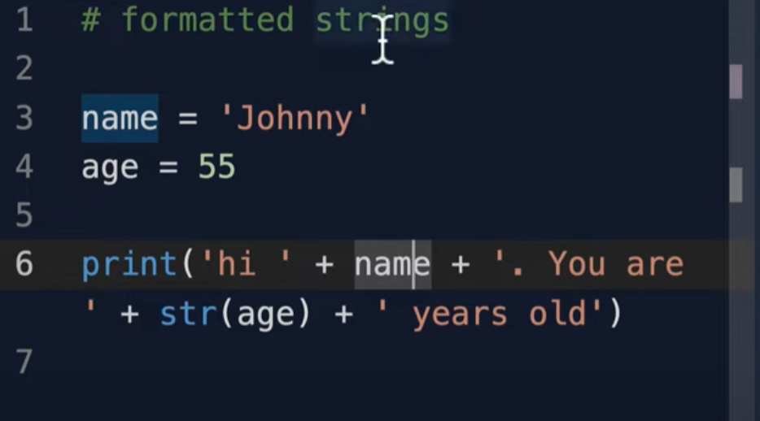


**Do like this (Recommended)**

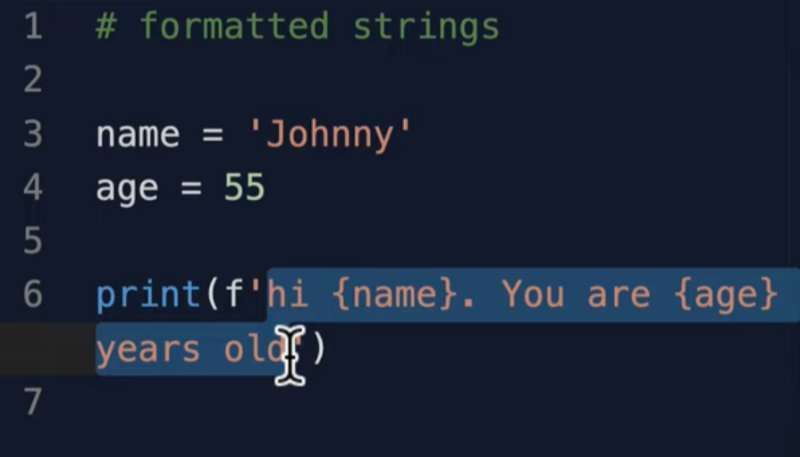

**Older method**

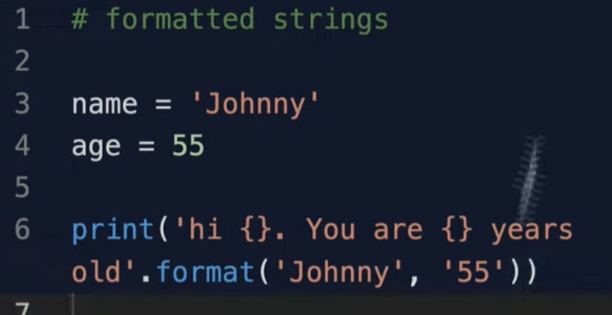

> 🟦🟦🟦🟦🟦🟦🟦🟦🟦🟦🟦🟦🟦🟦🟦🟦🟦🟦🟦🟦🟦🟦🟦🟦🟦🟦🟦🟦🟦🟦🟦🟦🟦🟦🟦🟦🟦🟦🟦🟦🟦🟦🟦🟦🟦🟦🟦🟦🟦🟦🟦🟦🟦🟦🟦🟦

# Built-in Functions and Methods in Python

## Built-in Functions

Definition:

Built-in functions are functions that are always available in Python without needing to import any library.

**Examples:**

print()

len()

type()

max()

min()

sum()

input()

```python
name = "Alice"
print(len(name))  # Output: 5
```


## Methods

Definition:

Methods are functions that belong to objects (like strings, lists, etc.) and are called using **dot** notation.

Examples of String Methods:

upper()

lower()

find()

replace()

strip()

**Example**

```python
text = "Hello, World!"
print(text.upper())    # Output: 'HELLO, WORLD!'
print(text.replace("World", "Python"))  # Output: 'Hello, Python!'
```


Difference Between Built-in Functions and Methods

| Built-in Function | Method                   |
| ----------------- | ------------------------ |
| Used directly     | Called on an object      |
| `len(text)`       | `text.upper()`           |
| `print(name)`     | `name.replace("a", "b")` |


Summary:

Built-in functions are global and work on many types of data.

Methods are tied to specific objects and types (like strings or lists).


> 🟦🟦🟦🟦🟦🟦🟦🟦🟦🟦🟦🟦🟦🟦🟦🟦🟦🟦🟦🟦🟦🟦🟦🟦🟦🟦🟦🟦🟦🟦🟦🟦🟦🟦🟦🟦🟦🟦🟦🟦🟦🟦🟦🟦🟦🟦🟦🟦🟦🟦🟦🟦🟦🟦🟦🟦

# Best Practices for Commenting in Python

Use TODO, FIXME, and NOTE Tags
Use these to mark work that needs to be done or highlight important information.

```
# TODO: Refactor this function to improve efficiency
# FIXME: Handle case when input is None
# NOTE: This function assumes the input is always positive
```

> 🟦🟦🟦🟦🟦🟦🟦🟦🟦🟦🟦🟦🟦🟦🟦🟦🟦🟦🟦🟦🟦🟦🟦🟦🟦🟦🟦🟦🟦🟦🟦🟦🟦🟦🟦🟦🟦🟦🟦🟦🟦🟦🟦🟦🟦🟦🟦🟦🟦🟦🟦🟦🟦🟦🟦🟦

# List Slicing in Python

**Syntax**


```python

my_list[start:stop:step]

```

start: Index to begin at (inclusive; default is 0)

stop: Index to end at (exclusive)

step: How many elements to skip (default is 1)


**Common Examples:**

1. Get a Portion of a List
   
```python

numbers = [10, 20, 30, 40, 50, 60]

slice1 = numbers[1:4]      # [20, 30, 40]

```

2. Get the First N Elements

```python

first_three = numbers[:3]  # [10, 20, 30]

```

3. Get the Last N Elements

```python

last_two = numbers[-2:]    # [50, 60]

```

4. Skip Elements with Step

```python

every_other = numbers[::2] # [10, 30, 50]

```

5. Reverse a List
   
```python

reversed_list = numbers[::-1]  # [60, 50, 40, 30, 20, 10]

```

6. Copy a List
   
```python

copied = numbers[:]        # [10, 20, 30, 40, 50, 60]

```


Why Use List Slicing?

Quick data extraction

Non-destructive (doesn’t change the original list)

Makes your code more readable and concise


**Example**

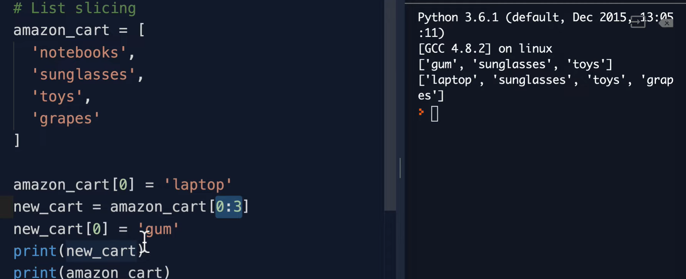


**Example 1**
if we do not add slicing then whet ever is in memory a = b, then b will also be modified so slicing is required here to not modify the existing  value  fo another variable

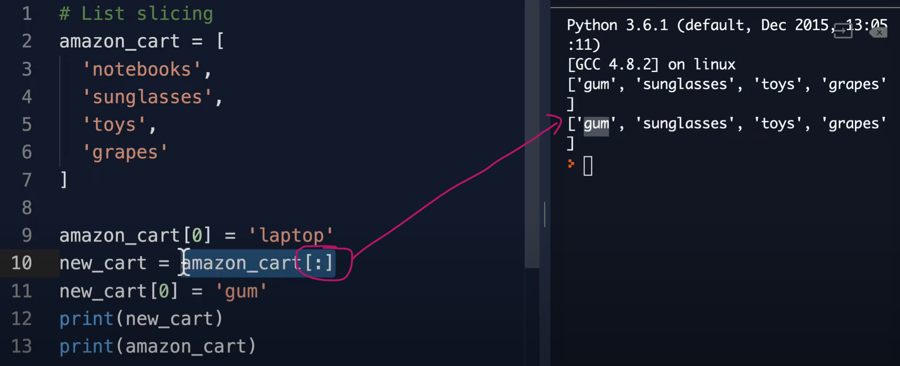


> 🟦🟦🟦🟦🟦🟦🟦🟦🟦🟦🟦🟦🟦🟦🟦🟦🟦🟦🟦🟦🟦🟦🟦🟦🟦🟦🟦🟦🟦🟦🟦🟦🟦🟦🟦🟦🟦🟦🟦🟦🟦🟦🟦🟦🟦🟦🟦🟦🟦🟦🟦🟦🟦🟦🟦🟦

# What is a Matrix in Python?

A matrix is a two-dimensional (2D) array of numbers—think of it as a table with rows and columns. In Python, a matrix can be represented in a couple of ways:

1. List of Lists (Basic Python)
You can use nested lists to represent a matrix:

```python
matrix = [
    [1, 2, 3],
    [4, 5, 6],
    [7, 8, 9]
]
```

Each inner list is a row.

The numbers in each row are the columns.


2. NumPy Arrays (Recommended for Math)
For more complex operations (like multiplication, slicing, and math functions), Python developers use the NumPy library, which has a special array type for matrices:

```python
import numpy as np

matrix = np.array([
    [1, 2, 3],
    [4, 5, 6],
    [7, 8, 9]
])
```

matrix.shape gives you (3, 3) (3 rows, 3 columns).

You can easily do mathematical operations with NumPy matrices.

**Why Use Matrices?**
For storing tabular data (like spreadsheets)

For mathematical operations (linear algebra, statistics, image processing)

For representing graphs, grids, and more

> 🟦🟦🟦🟦🟦🟦🟦🟦🟦🟦🟦🟦🟦🟦🟦🟦🟦🟦🟦🟦🟦🟦🟦🟦🟦🟦🟦🟦🟦🟦🟦🟦🟦🟦🟦🟦🟦🟦🟦🟦🟦🟦🟦🟦🟦🟦🟦🟦🟦🟦🟦🟦🟦🟦🟦🟦


# Common Python List Methods

Assume lst = [1, 2, 3] unless otherwise specified.

| Method         | Description                                           | Example              | Result            |
| -------------- | ----------------------------------------------------- | -------------------- | ----------------- |
| `append(x)`    | Add item `x` to the end                               | `lst.append(4)`      | `[1, 2, 3, 4]`    |
| `extend(iter)` | Add all items from iterable                           | `lst.extend([4, 5])` | `[1, 2, 3, 4, 5]` |
| `insert(i, x)` | Insert item `x` at position `i`                       | `lst.insert(1, 'a')` | `[1, 'a', 2, 3]`  |
| `remove(x)`    | Remove first occurrence of `x`                        | `lst.remove(2)`      | `[1, 3, 2]`       |
| `pop([i])`     | Remove and return item at position `i` (default last) | `lst.pop()`          | `3`, `[1, 2]`     |
| `clear()`      | Remove all items                                      | `lst.clear()`        | `[]`              |
| `index(x)`     | Return first index of value `x`                       | `lst.index(2)`       | `1`               |
| `count(x)`     | Count occurrences of value `x`                        | `lst.count(2)`       | `2`               |
| `sort()`       | Sort the list in place                                | `lst.sort()`         | `[1, 2, 3]`       |
| `reverse()`    | Reverse the elements of the list in place             | `lst.reverse()`      | `[3, 2, 1]`       |
| `copy()`       | Return a shallow copy of the list                     | `lst.copy()`         | `[1, 2, 3]`       |


## append

 - modifies inplace

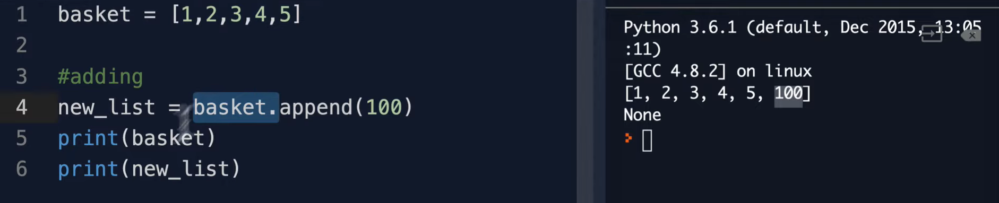


## insert

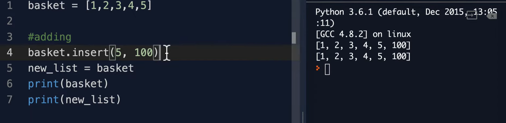


## extend

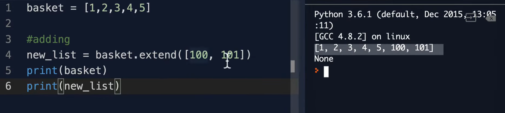


## remove and pop 

- pop index in array 

Remove and return item at position

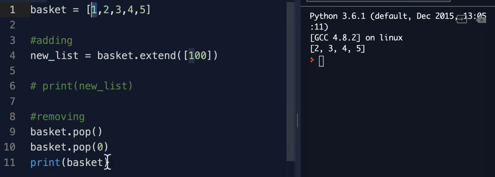


- remove value in array

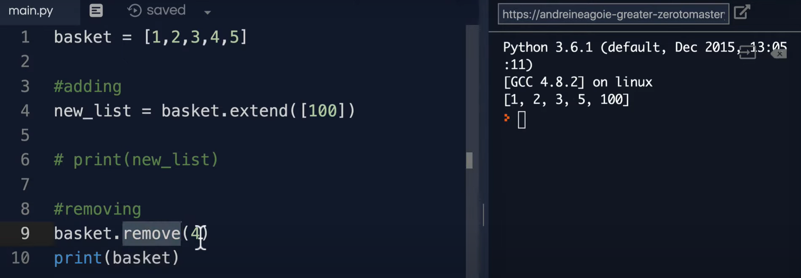


## index()

If the value is not found, it raises a ValueError.

```python
list.index(value, start, end)
```

- value — The item to search for.

- start (optional) — Start searching from this index.

- end (optional) — Stop searching at this index.

**Example Usage**

```python

lst = [1, 2, 3, 2, 4]
print(lst.index(2))      # Output: 1
print(lst.index(2, 2))   # Output: 3
# print(lst.index(5))    # Raises ValueError: 5 is not in list

```

## count()

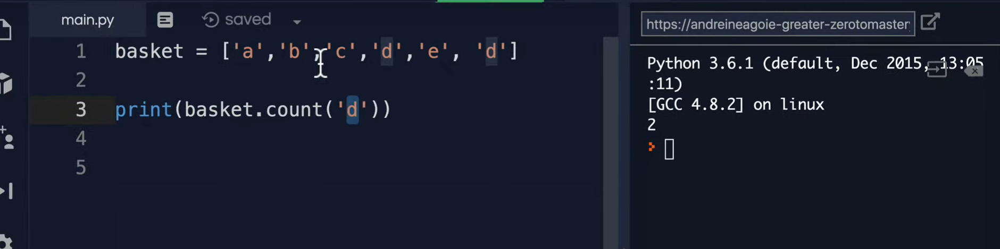


## sort() vs sorted() in Python

| Feature        | `sort()` (List Method)                    | `sorted()` (Built-in Function)     |
| -------------- | ----------------------------------------- | ---------------------------------- |
| Type           | List method                               | Built-in function                  |
| Modifies data? | **Modifies** the original list (in place) | **Does not modify**; returns new   |
| Return value   | Returns `None`                            | Returns a **new sorted list**      |
| Usable on      | **Lists only**                            | Any iterable (lists, tuples, etc.) |
| Syntax         | `my_list.sort()`                          | `sorted(my_iterable)`              |


> 🟦🟦🟦🟦🟦🟦🟦🟦🟦🟦🟦🟦🟦🟦🟦🟦🟦🟦🟦🟦🟦🟦🟦🟦🟦🟦🟦🟦🟦🟦🟦🟦🟦🟦🟦🟦🟦🟦🟦🟦🟦🟦🟦🟦🟦🟦🟦🟦🟦🟦🟦🟦🟦🟦🟦🟦

## Join

| Code                                 | Output         | Description                     |
| ------------------------------------ | -------------- | ------------------------------- |
| `",".join(["a", "b", "c"])`          | `"a,b,c"`      | Comma as separator              |
| `"-".join(["2025", "07", "05"])`     | `"2025-07-05"` | Dash as separator (date format) |
| `"".join(["H", "e", "l", "l", "o"])` | `"Hello"`      | No separator                    |


> 🟦🟦🟦🟦🟦🟦🟦🟦🟦🟦🟦🟦🟦🟦🟦🟦🟦🟦🟦🟦🟦🟦🟦🟦🟦🟦🟦🟦🟦🟦🟦🟦🟦🟦🟦🟦🟦🟦🟦🟦🟦🟦🟦🟦🟦🟦🟦🟦🟦🟦🟦🟦🟦🟦🟦🟦

# List Unpacking in Python

List unpacking allows you to assign the elements of a list (or any iterable) to multiple variables in a single statement.

Basic Unpacking

``` python

numbers = [1, 2, 3]
a, b, c = numbers
print(a)  # 1
print(b)  # 2
print(c)  # 3

```

Unpacking with the * Operator
You can use the * operator to capture multiple items:

```python
numbers = [1, 2, 3, 4, 5]
a, b, *rest = numbers
print(a)     # 1
print(b)     # 2
print(rest)  # [3, 4, 5]
```

Another example, capturing the last element:

```python
numbers = [1, 2, 3, 4, 5]
*start, end = numbers
print(start)  # [1, 2, 3, 4]
print(end)    # 5
```

Example with Function Return Values

```python
def get_point():
    return (3, 4)

x, y = get_point()
print(x)  # 3
print(y)  # 4
```

**Notes**
The number of variables on the left must match the number of items in the list, unless you use * to gather extras.

Works with any iterable (lists, tuples, strings, etc.).


**Example 1**
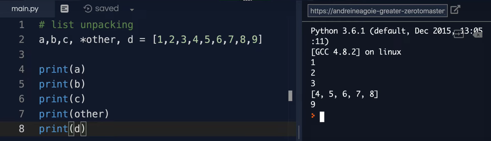


> 🟦🟦🟦🟦🟦🟦🟦🟦🟦🟦🟦🟦🟦🟦🟦🟦🟦🟦🟦🟦🟦🟦🟦🟦🟦🟦🟦🟦🟦🟦🟦🟦🟦🟦🟦🟦🟦🟦🟦🟦🟦🟦🟦🟦🟦🟦🟦🟦🟦🟦🟦🟦🟦🟦🟦🟦

#  None (Null)

None is a special constant in Python that represents the absence of a value or a null value.

It is similar to null in other programming languages.

**Usage**

Often used as a default value for function arguments.

Returned by functions that do not explicitly return a value.

**Example**
```python
result = None

def do_nothing():
    pass

print(do_nothing())  # Output: None
```


> 🟦🟦🟦🟦🟦🟦🟦🟦🟦🟦🟦🟦🟦🟦🟦🟦🟦🟦🟦🟦🟦🟦🟦🟦🟦🟦🟦🟦🟦🟦🟦🟦🟦🟦🟦🟦🟦🟦🟦🟦🟦🟦🟦🟦🟦🟦🟦🟦🟦🟦🟦🟦🟦🟦🟦🟦

# Dictionary  {}

A dictionary is a built-in Python data type that stores key-value pairs.
It is also sometimes called a hash map or associative array in other languages.

**Syntax**

```python
my_dict = {
    "name": "Alice",
    "age": 25,
    "city": "Paris"
}


```


**Key Features**

- Keys must be unique and immutable (strings, numbers, tuples).

- Values can be any data type and can be duplicated.

- Dictionaries are mutable (can be changed after creation).

- Access values using keys.

**Basic Operations**

| Operation                      | Example               | Result                       |
| ------------------------------ | --------------------- | ---------------------------- |
| Access value by key            | `my_dict["name"]`     | `"Alice"`                    |
| Add or update a key-value pair | `my_dict["age"] = 26` | age updated to `26`          |
| Remove a key-value pair        | `del my_dict["city"]` | removes `"city"`             |
| Check if key exists            | `"name" in my_dict`   | `True`                       |
| Get all keys                   | `my_dict.keys()`      | `dict_keys(['name', 'age'])` |
| Get all values                 | `my_dict.values()`    | `dict_values(['Alice', 26])` |
| Get all items                  | `my_dict.items()`     | `dict_items([...])`          |

**Example 1**


```python
person = {
    "name": "Bob",
    "age": 30
}
print(person["name"])    # Output: Bob

person["age"] = 31       # Update age
person["city"] = "NYC"   # Add new key-value pair

del person["name"]       # Remove key-value pair

if "city" in person:
    print("City:", person["city"])


print(person.get('last_name', 'defaultlast_name'))

```

**Example 2**

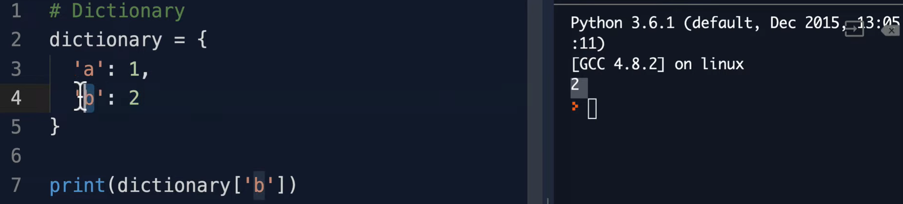


**Example 3**

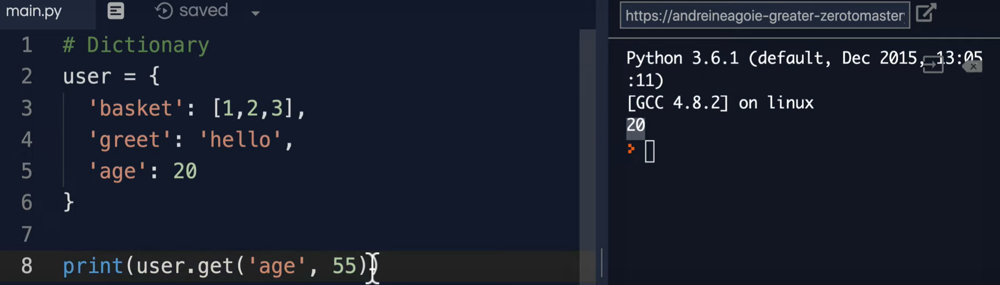


**Example 4** not common

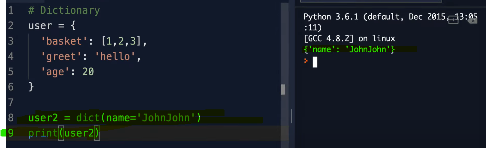


**Summary:**

As of Python 3.7 and later, dictionaries are ordered by insertion order (for all practical purposes).

In older versions, they are unordered.

**list of Dictionary**

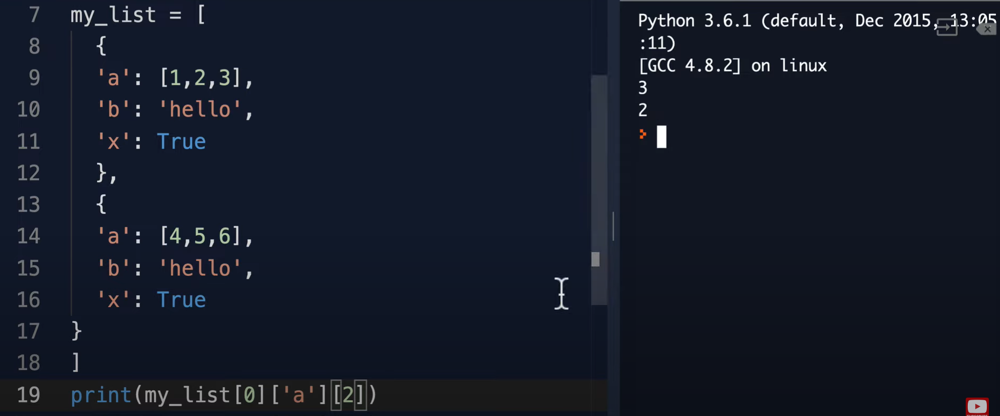

> 🟦🟦🟦🟦🟦🟦🟦🟦🟦🟦🟦🟦🟦🟦🟦🟦🟦🟦🟦🟦🟦🟦🟦🟦🟦🟦🟦🟦🟦🟦🟦🟦🟦🟦🟦🟦🟦🟦🟦🟦🟦🟦🟦🟦🟦🟦🟦🟦🟦🟦🟦🟦🟦🟦🟦🟦

# Data Structures

A data structure is a way of organizing, managing, and storing data for efficient access and modification.

**Common Built-in Data Structures**

| Data Structure | Description                          | Example Syntax     |
| -------------- | ------------------------------------ | ------------------ |
| **List**       | Ordered, mutable sequence            | `[1, 2, 3]`        |
| **Tuple**      | Ordered, immutable sequence          | `(1, 2, 3)`        |
| **Dictionary** | Key-value pairs, mutable, ordered    | `{"a": 1, "b": 2}` |
| **Set**        | Unordered collection of unique items | `{1, 2, 3}`        |
| **String**     | Ordered, immutable sequence of chars | `"hello"`          |

**What Makes Data Structures Important?**
They help organize data efficiently for tasks like searching, sorting, and modifying.

The right data structure improves performance and readability of code.


Examples

List (dynamic array):

```python

numbers = [10, 20, 30]
numbers.append(40)
```

Tuple (immutable list):

```python

point = (1, 2)
```

Dictionary (hash map):

```python

person = {"name": "Alice", "age": 25}
```

Set (unique items):

```python

unique_numbers = {1, 2, 3, 3}
# unique_numbers: {1, 2, 3}
```

**Advanced Data Structures (from collections module)**

| Data Structure | Description                              |
| -------------- | ---------------------------------------- |
| `deque`        | Double-ended queue                       |
| `Counter`      | Counts hashable objects                  |
| `OrderedDict`  | Dict that remembers insertion order      |
| `defaultdict`  | Dict with default value for missing keys |


**Summary:**
Data structures are essential for organizing and processing data efficiently in Python.


> 🟦🟦🟦🟦🟦🟦🟦🟦🟦🟦🟦🟦🟦🟦🟦🟦🟦🟦🟦🟦🟦🟦🟦🟦🟦🟦🟦🟦🟦🟦🟦🟦🟦🟦🟦🟦🟦🟦🟦🟦🟦🟦🟦🟦🟦🟦🟦🟦🟦🟦🟦🟦🟦🟦🟦🟦

# Common Dictionary Methods in Python

| Method                       | Description                                                | Example                         | Result / Usage       |
| ---------------------------- | ---------------------------------------------------------- | ------------------------------- | -------------------- |
| `get(key, [default])`        | Returns the value for `key`, or `default` if not found     | `d.get("a")`<br>`d.get("b", 0)` | Value or default     |
| `keys()`                     | Returns a view of all keys                                 | `d.keys()`                      | `dict_keys([...])`   |
| `values()`                   | Returns a view of all values                               | `d.values()`                    | `dict_values([...])` |
| `items()`                    | Returns a view of all (key, value) pairs                   | `d.items()`                     | `dict_items([...])`  |
| `update(other)`              | Updates the dictionary with key/value pairs from `other`   | `d.update({"b": 2})`            | Modifies `d`         |
| `pop(key[, default])`        | Removes specified key and returns the value                | `d.pop("a")`<br>`d.pop("x", 0)` | Value or default     |
| `popitem()`                  | Removes and returns a (key, value) pair (last inserted)    | `d.popitem()`                   | Tuple `(key, value)` |
| `clear()`                    | Removes all items                                          | `d.clear()`                     | `d` becomes `{}`     |
| `setdefault(key[, default])` | Returns value if key exists, else inserts key with default | `d.setdefault("a", 0)`          | Value                |
| `copy()`                     | Returns a shallow copy of the dictionary                   | `d.copy()`                      | New dict             |
| `fromkeys(keys[, value])`    | Creates a new dict with keys and same value                | `dict.fromkeys(["a", "b"], 0)`  | `{'a': 0, 'b': 0}`   |


```python
d = {"a": 1, "b": 2}

print(d.get("a"))        # 1
print(d.keys())          # dict_keys(['a', 'b'])
print(d.values())        # dict_values([1, 2])
print(d.items())         # dict_items([('a', 1), ('b', 2)])
d.update({"c": 3})       
print(d)                 # {'a': 1, 'b': 2, 'c': 3}
value = d.pop("a")       
print(value)             # 1
print(d)                 # {'b': 2, 'c': 3}
d.clear()                
print(d)                 # {}
```

## values()
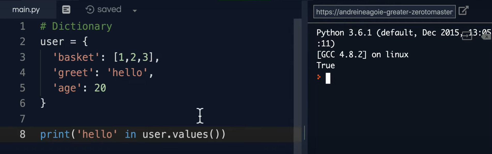


## items

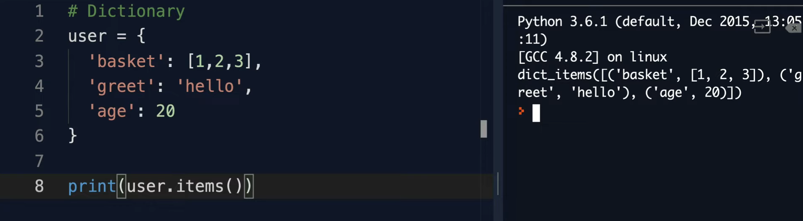


 
> 🟦🟦🟦🟦🟦🟦🟦🟦🟦🟦🟦🟦🟦🟦🟦🟦🟦🟦🟦🟦🟦🟦🟦🟦🟦🟦🟦🟦🟦🟦🟦🟦🟦🟦🟦🟦🟦🟦🟦🟦🟦🟦🟦🟦🟦🟦🟦🟦🟦🟦🟦🟦🟦🟦🟦🟦

# Tuple (Definition & Use)

**What is a tuple?**

A tuple is an ordered, immutable collection of items. This means:

- The order of items is preserved.

- Once created, the contents cannot be changed (no add/remove/replace).


```python
my_tuple = (1, "hello", 3.5)
```

**Key properties:**

- Immutable: You cannot change the elements after creation.

- Can contain any type: Numbers, strings, lists, even other tuples.

- Can be nested: Tuples inside tuples.

**Accessing Elements:**

```python
print(my_tuple[1])  # Output: 'hello'
```

**Why use tuples?**

- Useful for fixed collections (e.g., coordinates: (x, y)).

- Tuples can be used as dictionary keys (lists cannot).

**Single-element tuple:**

Add a comma, otherwise Python thinks it’s just a value in parentheses.

```python
single = (42,)  # This is a tuple
not_a_tuple = (42)  # This is just the number 42
```

Tuple Example
```python
person = ("Alice", 30, "Engineer")
print(person[0])  # Output: Alice
```

## Tuple vs. List

|          | Tuple              | List          |
| -------- | ------------------ | ------------- |
| Syntax   | (a, b, c)          | \[a, b, c]    |
| Mutable  | No                 | Yes           |
| Hashable | Yes (if items are) | No            |
| Use      | Fixed data         | Variable data |

## Tuple vs Dictionary in Python

| Feature       | **Tuple**                                                               | **Dictionary**                                                                                   |
| ------------- | ----------------------------------------------------------------------- | ------------------------------------------------------------------------------------------------ |
| **Syntax**    | `my_tuple = (1, 2, 3)`                                                  | `my_dict = {'a': 1, 'b': 2}`                                                                     |
| **Type**      | Ordered sequence                                                        | Unordered (as of Python 3.7+, dictionaries preserve insertion order, but conceptually unordered) |
| **Access**    | By **index** (e.g. `x[0]`)                                              | By **key** (e.g. `x['a']`)                                                                       |
| **Mutable?**  | **Immutable** (cannot change after creation)                            | **Mutable** (can add, remove, or change values)                                                  |
| **Purpose**   | Store fixed, ordered collection of items (like coordinates or a record) | Store data as key-value pairs (like a mapping or a lookup table)                                 |
| **Hashable?** | Yes (if all elements are hashable)                                      | No (but keys must be hashable)                                                                   |
| **Use case**  | Fixed collections, function returns, as dictionary keys                 | Fast lookup, data mapping, flexible data structures                                              |


**Tuple Example**

```python
# Tuple: Ordered, fixed collection
point = (10, 20)
print(point[0])  # Output: 10

```

**Dictionary Example**

```python
# Dictionary: Mapping keys to values
person = {'name': 'Alice', 'age': 30}
print(person['name'])  # Output: Alice
```

**When to Use Which?**

**Tuple:**

    When you want to store an ordered collection that won’t change.

    Example: coordinates (x, y), RGB color (255, 255, 0), multiple return values from a function.

**Dictionary:**

    When you need to associate values with names (keys) for fast access.

    Example: a person's profile, a settings table, word-frequency counters.


> 🟦🟦🟦🟦🟦🟦🟦🟦🟦🟦🟦🟦🟦🟦🟦🟦🟦🟦🟦🟦🟦🟦🟦🟦🟦🟦🟦🟦🟦🟦🟦🟦🟦🟦🟦🟦🟦🟦🟦🟦🟦🟦🟦🟦🟦🟦🟦🟦🟦🟦🟦🟦🟦🟦🟦🟦

# Set in Python

## Definition

- A **set** is an **unordered collection of unique items**.
- Duplicates are not allowed.
- Useful for membership tests, removing duplicates, and mathematical set operations (union, intersection, difference).

---

## Syntax

```python
my_set = {1, 2, 3}
```

Or using the set() constructor:

```python

my_set = set([1, 2, 3])

```

**Note:**
To create an empty set, use set(), not {} (because {} creates an empty dictionary).


**Key Properties**
- Unordered: No indexing or slicing (can’t do my_set[0]).

- Mutable: You can add or remove items.

- Unique items: Any duplicates are automatically removed.

- Items must be hashable (immutable): You can’t put lists or other sets inside a set.

**Common Operations**

```python
a = {1, 2, 3}
b = {3, 4, 5}

a.add(4)          # Add an element: {1, 2, 3, 4}
a.remove(1)       # Remove an element: {2, 3, 4}
a.union(b)        # {2, 3, 4, 5}
a.intersection(b) # {3, 4}
a.difference(b)   # {2}
```

## Use Cases

**Remove duplicates from a list:**
```python
nums = [1, 2, 2, 3, 1]
unique_nums = set(nums)  # {1, 2, 3}
```

**Check if an item exists (fast):**

```python

2 in unique_nums  # True
Mathematical set operations (union, intersection, etc.)
```

## Comparison Table: Set vs List vs Tuple

| Feature   | Set         | List        | Tuple       |
| --------- | ----------- | ----------- | ----------- |
| Ordered?  | No          | Yes         | Yes         |
| Mutable?  | Yes         | Yes         | No          |
| Unique?   | Yes         | No          | No          |
| Syntax    | `{1, 2, 3}` | `[1, 2, 3]` | `(1, 2, 3)` |
| Indexing? | No          | Yes         | Yes         |


## Set Methods


| Method                            | Description                                       | Example                                |
| --------------------------------- | ------------------------------------------------- | -------------------------------------- |
| `.add(x)`                         | Adds element `x` to the set                       | `s.add(5)`                             |
| `.remove(x)`                      | Removes `x`; raises error if not present          | `s.remove(2)`                          |
| `.discard(x)`                     | Removes `x` if present (no error if not)          | `s.discard(3)`                         |
| `.pop()`                          | Removes and returns a random element              | `s.pop()`                              |
| `.clear()`                        | Removes all elements from the set                 | `s.clear()`                            |
| `.copy()`                         | Returns a shallow copy of the set                 | `s2 = s.copy()`                        |
| `.union(t)`                       | Returns a new set with elements from both sets    | `s.union(t)` or `s                     | t` |
| `.intersection(t)`                | Common elements of sets                           | `s.intersection(t)` or `s & t`         |
| `.difference(t)`                  | Elements in set s but not in t                    | `s.difference(t)` or `s - t`           |
| `.symmetric_difference(t)`        | Elements in either set, but not both              | `s.symmetric_difference(t)` or `s ^ t` |
| `.update(t)`                      | Adds elements from set t (in-place union)         | `s.update(t)`                          |
| `.intersection_update(t)`         | Keeps only common elements (in-place)             | `s.intersection_update(t)`             |
| `.difference_update(t)`           | Removes elements in t from s (in-place)           | `s.difference_update(t)`               |
| `.symmetric_difference_update(t)` | Updates s with symmetric diff                     | `s.symmetric_difference_update(t)`     |
| `.issubset(t)`                    | Checks if s is subset of t (returns True/False)   | `s.issubset(t)`                        |
| `.issuperset(t)`                  | Checks if s is superset of t (returns True/False) | `s.issuperset(t)`                      |
| `.isdisjoint(t)`                  | Checks if sets have no elements in common         | `s.isdisjoint(t)`                      |

---

## Example

```python
a = {1, 2, 3}
b = {3, 4, 5}

a.add(4)                # a = {1, 2, 3, 4}
a.remove(1)             # a = {2, 3, 4}
a.discard(10)           # No error if 10 not present
c = a.union(b)          # c = {2, 3, 4, 5}
a.intersection_update(b) # a now only common elements with b: a = {3, 4}
```


> 🟦🟦🟦🟦🟦🟦🟦🟦🟦🟦🟦🟦🟦🟦🟦🟦🟦🟦🟦🟦🟦🟦🟦🟦🟦🟦🟦🟦🟦🟦🟦🟦🟦🟦🟦🟦🟦🟦🟦🟦🟦🟦🟦🟦🟦🟦🟦🟦🟦🟦🟦🟦🟦🟦🟦🟦

# Conditional Logic

Conditional logic allows your program to make decisions and execute certain code only when specific conditions are met. In Python, you use if, elif, and else statements.

## Basic If Statement

```python
age = 18

if age >= 18:
    print("You are an adult!")

```

##  If-Else Statement

```python

age = 16

if age >= 18:
    print("You are an adult!")
else:
    print("You are not an adult.")

```

## If-Elif-Else Chain

```python

age = 15

if age >= 18:
    print("You are an adult!")
elif age >= 13:
    print("You are a teenager!")
else:
    print("You are a child!")
```

## Multiple Conditions (Logical Operators)

```python

temperature = 25

if temperature > 20 and temperature < 30:
    print("It's a nice day!")

```


##  Inline (Ternary) Conditional

```python

age = 20
message = "Adult" if age >= 18 else "Minor"
print(message)

```


> 🟦🟦🟦🟦🟦🟦🟦🟦🟦🟦🟦🟦🟦🟦🟦🟦🟦🟦🟦🟦🟦🟦🟦🟦🟦🟦🟦🟦🟦🟦🟦🟦🟦🟦🟦🟦🟦🟦🟦🟦🟦🟦🟦🟦🟦🟦🟦🟦🟦🟦🟦🟦🟦🟦🟦🟦

# Truthy and Falsy Values
In Python, values are automatically considered True or False when used in conditional statements (if, while, etc.).

**What is Truthy?**
A value is truthy if Python considers it as True in a boolean context.

**What is Falsy?**
A value is falsy if Python considers it as False in a boolean context.

**Common Falsy Values**

The following values are falsy in Python:

- None

- False

- 0 (zero of any numeric type: 0, 0.0, 0j)

- Empty sequences or collections:

    - '' (empty string)

    - [] (empty list)

    - {} (empty dict)

    - () (empty tuple)

    - set() (empty set)

    - range(0)

    - All other values are truthy.


## Example: Using Truthy and Falsy Values

```python
# Falsy examples
if []:
    print("This will NOT print.")
if 0:
    print("This will NOT print.")
if None:
    print("This will NOT print.")
if "":
    print("This will NOT print.")

# Truthy examples
if [1, 2, 3]:
    print("This WILL print, list is not empty.")
if "Hello":
    print("This WILL print, string is not empty.")
if 42:
    print("This WILL print, number is not zero.")

```

**Checking if a Value is Truthy or Falsy**

You can use the bool() function to see how Python evaluates a value:

```python
print(bool([]))      # False
print(bool([1, 2]))  # True
print(bool(0))       # False
print(bool(3.14))    # True
print(bool(""))      # False
print(bool("hi"))    # True
```

**Tip:**

Use truthy and falsy values for clean, readable conditions:

```python
if my_list:  # Checks if list is not empty
    print("List has items!")
else:
    print("List is empty!")
```


> 🟦🟦🟦🟦🟦🟦🟦🟦🟦🟦🟦🟦🟦🟦🟦🟦🟦🟦🟦🟦🟦🟦🟦🟦🟦🟦🟦🟦🟦🟦🟦🟦🟦🟦🟦🟦🟦🟦🟦🟦🟦🟦🟦🟦🟦🟦🟦🟦🟦🟦🟦🟦🟦🟦🟦🟦

# is vs == in Python

## == (Equality)
- Checks if values are equal.

- Compares the contents of two objects.

```python
a = [1, 2, 3]
b = [1, 2, 3]

print(a == b)  # True, because their contents are the same

```

## is (Identity)
- Checks if two variables point to the same object in memory.

- Compares the identity (location in memory) of objects.


```python
a = [1, 2, 3]
b = [1, 2, 3]
c = a

print(a is b)  # False, different objects with same contents
print(a is c)  # True, both refer to the same object in memory


```

**Example Table**

| Operation | Checks for   | Example              | Result  |
| --------- | ------------ | -------------------- | ------- |
| `a == b`  | **Equality** | `[1,2,3] == [1,2,3]` | `True`  |
| `a is b`  | **Identity** | `[1,2,3] is [1,2,3]` | `False` |
| `a is c`  | **Identity** | `a is c`             | `True`  |


**Special Note: Small Integers and Strings**
For small numbers and short strings, Python may reuse objects for efficiency:

```python
x = 5
y = 5
print(x is y)  # True (for small integers)

s1 = "hi"
s2 = "hi"
print(s1 is s2)  # True (for short strings, sometimes)
```
**But don’t rely on is for value comparison!**


**When to Use**
- Use == for checking if values are the same.

- Use is for checking if two variables point to the same object (often used with None: if var is None:).


> 🟦🟦🟦🟦🟦🟦🟦🟦🟦🟦🟦🟦🟦🟦🟦🟦🟦🟦🟦🟦🟦🟦🟦🟦🟦🟦🟦🟦🟦🟦🟦🟦🟦🟦🟦🟦🟦🟦🟦🟦🟦🟦🟦🟦🟦🟦🟦🟦🟦🟦🟦🟦🟦🟦🟦🟦

# Loops in Python

Loops are used to execute a block of code multiple times. Python provides two main types of loops: for loops and while loops.

## 1. For Loop
Used to iterate over a sequence (like a list, tuple, string, or range).

```python
# Loop over a list
fruits = ['apple', 'banana', 'cherry']
for fruit in fruits:
    print(fruit)

# Loop over a range of numbers
for i in range(5):
    print(i)  # Prints 0, 1, 2, 3, 4


```

## 2. While Loop
Repeats a block of code as long as a condition is True.

```python

count = 0
while count < 5:
    print(count)
    count += 1  # Increment count to avoid infinite loop

```


## 3. Loop Control Statements
- break: Exit the loop immediately.

- continue: Skip to the next iteration.

- pass: Do nothing (placeholder).

```python

for i in range(5):
    if i == 3:
        break  # Exits loop when i == 3
    print(i)

for i in range(5):
    if i == 3:
        continue  # Skips 3
    print(i)

```


## 4. Looping with Index
Use enumerate() to get both the index and value:


```python

names = ['Alice', 'Bob', 'Charlie']
for index, name in enumerate(names):
    print(index, name)

```


## 5. Nested Loops
You can put one loop inside another:

```python

for i in range(3):
    for j in range(2):
        print(f"i={i}, j={j}")


```


## 6. For Loop with Dictionaries
Loop through keys, values, or both:

```python

my_dict = {'a': 1, 'b': 2}
for key in my_dict:
    print(key)  # keys

for value in my_dict.values():
    print(value)  # values

for key, value in my_dict.items():
    print(key, value)  # both

```


**Tip:**
Use for loops when you know how many times to loop, and while loops when you want to repeat until a condition changes.


> 🟦🟦🟦🟦🟦🟦🟦🟦🟦🟦🟦🟦🟦🟦🟦🟦🟦🟦🟦🟦🟦🟦🟦🟦🟦🟦🟦🟦🟦🟦🟦🟦🟦🟦🟦🟦🟦🟦🟦🟦🟦🟦🟦🟦🟦🟦🟦🟦🟦🟦🟦🟦🟦🟦🟦🟦

# Iterables 

An iterable is any Python object that can return its members one at a time, allowing it to be looped over (for example, in a for loop).

**What is an Iterable?**
An object is iterable if it can be passed to the built-in iter() function and returns an iterator.

Common examples: lists, tuples, strings, dictionaries, sets, files, and even some custom objects.

**Examples of Iterables**
```python

my_list = [1, 2, 3]      # list
my_tuple = (4, 5, 6)     # tuple
my_str = "hello"         # string
my_dict = {'a': 1, 'b': 2}  # dictionary
my_set = {7, 8, 9}       # set

# All are iterables!
for x in my_list:
    print(x)

for letter in my_str:
    print(letter)

```

**Checking if an Object is Iterable**
You can check if an object is iterable by trying to create an iterator with iter(), or by importing Iterable from collections.abc:

```python

from collections.abc import Iterable

print(isinstance([1, 2, 3], Iterable))  # True
print(isinstance(100, Iterable))        # False

```

## Difference Between Iterable and Iterator
Iterable: An object you can loop over (e.g., a list).

Iterator: An object that produces values from an iterable, one at a time, using next().

Example:

```python
nums = [1, 2, 3]
it = iter(nums)  # 'it' is now an iterator

print(next(it))  # 1
print(next(it))  # 2
print(next(it))  # 3
# next(it) now would raise StopIteration


```

## Why Are Iterables Important?
All objects you can use in a for loop are iterables.

Functions like sum(), max(), and sorted() all accept iterables.

You can create your own iterables by defining an __iter__() method in your class.

**Summary:**
An iterable is anything you can loop over in Python!


> 🟦🟦🟦🟦🟦🟦🟦🟦🟦🟦🟦🟦🟦🟦🟦🟦🟦🟦🟦🟦🟦🟦🟦🟦🟦🟦🟦🟦🟦🟦🟦🟦🟦🟦🟦🟦🟦🟦🟦🟦🟦🟦🟦🟦🟦🟦🟦🟦🟦🟦🟦🟦🟦🟦🟦🟦

# range 

The range() function generates a sequence of numbers, which is often used for looping a specific number of times in for loops.


**Basic Usage**
```python

for i in range(5):
    print(i)


```

**Output**


```python

range(stop)              # 0 to stop-1
range(start, stop)       # start to stop-1
range(start, stop, step) # start to stop-1, incremented by step


```

Counts from 0 up to, but not including, 5.


**Syntax**
```python

range(stop)              # 0 to stop-1
range(start, stop)       # start to stop-1
range(start, stop, step) # start to stop-1, incremented by step

```


**Examples**


```python

# range(stop)
for i in range(3):
    print(i)  # 0, 1, 2

# range(start, stop)
for i in range(2, 5):
    print(i)  # 2, 3, 4

# range(start, stop, step)
for i in range(0, 10, 2):
    print(i)  # 0, 2, 4, 6, 8

# Counting backwards
for i in range(5, 0, -1):
    print(i)  # 5, 4, 3, 2, 1


```


**Note**
- range() returns a range object, which is an immutable sequence of numbers.

- If you need a list, you can convert it: list(range(5)) → [0, 1, 2, 3, 4]

- range() is memory efficient—it does not generate all numbers at once, just as needed.


**Summary:**
Use range() when you want to loop a specific number of times or generate sequences of numbers.

> 🟦🟦🟦🟦🟦🟦🟦🟦🟦🟦🟦🟦🟦🟦🟦🟦🟦🟦🟦🟦🟦🟦🟦🟦🟦🟦🟦🟦🟦🟦🟦🟦🟦🟦🟦🟦🟦🟦🟦🟦🟦🟦🟦🟦🟦🟦🟦🟦🟦🟦🟦🟦🟦🟦🟦🟦

# enumerate()

The built-in enumerate() function adds a counter to an iterable and returns it as an enumerate object (which yields pairs of an index and the value).

**Why Use enumerate()?**
- It’s useful when you want both the index and the item in a loop.

- More readable and Pythonic than manually tracking the index.


**Basic Example**

```python

fruits = ['apple', 'banana', 'cherry']

for index, fruit in enumerate(fruits):
    print(f"Index: {index}, Fruit: {fruit}")

```


**Output:**

```python

Index: 0, Fruit: apple
Index: 1, Fruit: banana
Index: 2, Fruit: cherry

```


**Start at a Different Index**
You can specify the starting index (default is 0):

```python

for idx, fruit in enumerate(fruits, start=1):
    print(f"{idx}. {fruit}")

```


**Output:**

```markdown

1. apple
2. banana
3. cherry

```

**What Does enumerate() Return?**
- Returns an enumerate object (an iterator).

- You can convert it to a list or tuple:

```python

nums = ['a', 'b', 'c']
print(list(enumerate(nums)))  # [(0, 'a'), (1, 'b'), (2, 'c')]

```

**Summary Table**

| Function                          | Use Case                        |
| --------------------------------- | ------------------------------- |
| `for i in range(n)`               | When you just need indexes      |
| `for x in iterable`               | When you just need items        |
| `for i, x in enumerate(iterable)` | When you need both index & item |


**Summary:**

Use enumerate() to get both the index and the value when looping over a sequence.

> 🟦🟦🟦🟦🟦🟦🟦🟦🟦🟦🟦🟦🟦🟦🟦🟦🟦🟦🟦🟦🟦🟦🟦🟦🟦🟦🟦🟦🟦🟦🟦🟦🟦🟦🟦🟦🟦🟦🟦🟦🟦🟦🟦🟦🟦🟦🟦🟦🟦🟦🟦🟦🟦🟦🟦🟦

# while Loop

A while loop repeatedly executes a block of code as long as a given condition is True.

**Basic Syntax**


```python
while condition:
    # code to run while condition is True


```


## Simple Example


```python

count = 0
while count < 5:
    print(count)
    count += 1  # Increase count to avoid infinite loop

```


**Output:**
```python

0
1
2
3
4

```


## Infinite Loop
If the condition is always True, the loop never stops (be careful!):
```python

while True:
    print("This will print forever!")
    break  # Add a break to avoid infinite loop

```


## Using break and continue
- break: Exit the loop immediately.

- continue: Skip to the next iteration.

```python

i = 0
while i < 5:
    i += 1
    if i == 3:
        continue  # Skips the rest of this loop when i == 3
    if i == 5:
        break  # Exits loop when i == 5
    print(i)

```

**Output:**
```python

1
2
4

```

## When to Use a while Loop
- When you don’t know in advance how many times you need to loop.

- Common in input validation, games, and situations where you loop until a certain condition changes.


**Summary:**

A while loop keeps looping as long as its condition is True. Don’t forget to update the variables involved in the condition, or you might get an infinite loop!


> 🟦🟦🟦🟦🟦🟦🟦🟦🟦🟦🟦🟦🟦🟦🟦🟦🟦🟦🟦🟦🟦🟦🟦🟦🟦🟦🟦🟦🟦🟦🟦🟦🟦🟦🟦🟦🟦🟦🟦🟦🟦🟦🟦🟦🟦🟦🟦🟦🟦🟦🟦🟦🟦🟦🟦🟦

# while ... else

- The else block after a while loop runs only if the loop ends normally (i.e., the condition becomes False).

- If the loop is exited with break, the else block is skipped.

## Basic Example

```python
count = 0
while count < 3:
    print(count)
    count += 1
else:
    print("Loop finished without break.")

```


**Output:**

```kotlin
0
1
2
Loop finished without break.

```


## Example with break


```python
count = 0
while count < 5:
    if count == 3:
        break
    print(count)
    count += 1
else:
    print("Loop finished without break.")

```


Output:

```python
0
1
2

```
The loop exits with break, so else does not run.


## When to Use while ... else
- Often used when searching for something:
If you break because you found it, else won’t run.
If you don’t break (didn’t find it), else runs.

**Example: Searching for a Value**
```python
nums = [1, 3, 5, 7]
target = 4
i = 0

while i < len(nums):
    if nums[i] == target:
        print("Found!")
        break
    i += 1
else:
    print("Not found!")

```

**Output:**

```mathematica
Not found!

```


**Summary:**

The else after a while loop runs only if the loop wasn’t stopped by break.

> 🟦🟦🟦🟦🟦🟦🟦🟦🟦🟦🟦🟦🟦🟦🟦🟦🟦🟦🟦🟦🟦🟦🟦🟦🟦🟦🟦🟦🟦🟦🟦🟦🟦🟦🟦🟦🟦🟦🟦🟦🟦🟦🟦🟦🟦🟦🟦🟦🟦🟦🟦🟦🟦🟦🟦🟦

# break vs continue vs pass

| Statement  | What it does                                                  | Typical Use                          |
| ---------- | ------------------------------------------------------------- | ------------------------------------ |
| `break`    | **Exits** the nearest enclosing loop                          | Stop looping when a condition is met |
| `continue` | **Skips** the rest of the loop body for the current iteration | Skip an iteration but keep looping   |
| `pass`     | Does **nothing** (acts as a placeholder)                      | To write empty code blocks or stubs  |


**Examples**

## break  — Stop When You Find What You Need


```python

for i in range(5):
    if i == 3:
        break
    print(i)

```


**Output:**
```python

0
1
2

```
Stops looping when i is 3.


```python

nums = [1, 3, 5, 7, 9]
target = 5

for num in nums:
    if num == target:
        print("Found it!")
        break  # Stop searching once found


```


**Use case:**

Exiting a search loop early for efficiency.

Stopping on error conditions.


## continue — Skip Unwanted Iterations
 
```python

for i in range(5):
    if i == 3:
        continue
    print(i)

```


**Output:**

```python

0
1
2
4

```
Skips printing when i is 3, but keeps looping.

**Example: Print only even numbers**

```python
for i in range(10):
    if i % 2 != 0:
        continue  # Skip odd numbers
    print(i)

```
**Use case:**

Filtering data while looping.

Skipping invalid, missing, or special-case values.


## pass  — Write Code Stubs or Placeholders

Example: Defining an empty function or future TODO


```python

for i in range(5):
    if i == 3:
        pass  # Does nothing, loop continues as normal
    print(i)

```


**Output:**

```python

0
1
2
3
4

```
pass is just a placeholder; it does nothing and does not affect the loop.

```python

def my_function():
    pass  # Will implement later

# Or inside loops or conditionals
for i in range(5):
    if i == 2:
        pass  # TODO: add special handling for i==2
    print(i)


```

**Use case:**

Placeholder for code to be written later.

Required when a block must not be empty (to avoid syntax errors).

Used in empty classes, functions, or if/else branches.


## More Advanced Example: Combining All Three

```python

data = [1, None, 3, 0, 5, 'skip', 7]

for item in data:
    if item is None:
        continue      # Skip None values
    if item == 0:
        break         # Stop on zero
    if item == 'skip':
        pass          # Just a placeholder, does nothing
    print(item)


```

## When to Use Each
- break: When you want to exit a loop immediately.

- continue: When you want to skip the rest of the loop body for the current iteration and go to the next iteration.

- pass: When a statement is syntactically required but you don't want any code to run (for example, stubs, TODOs, or empty function/class bodies).


**Summary Table**

| Statement  | Effect in Loop             |
| ---------- | -------------------------- |
| `break`    | Exits loop entirely        |
| `continue` | Skips to next iteration    |
| `pass`     | Does nothing (placeholder) |


> 🟦🟦🟦🟦🟦🟦🟦🟦🟦🟦🟦🟦🟦🟦🟦🟦🟦🟦🟦🟦🟦🟦🟦🟦🟦🟦🟦🟦🟦🟦🟦🟦🟦🟦🟦🟦🟦🟦🟦🟦🟦🟦🟦🟦🟦🟦🟦🟦🟦🟦🟦🟦🟦🟦🟦🟦

# First Graphic

```python

picture = [
    [0, 0, 0, 1, 0, 0, 0],
    [0, 0, 1, 1, 1, 0, 0],
    [0, 1, 1, 1, 1, 1, 0],
    [1, 1, 1, 1, 1, 1, 1],
    [0, 0, 0, 1, 0, 0, 0],
    [0, 0, 0, 1, 0, 0, 0]
]


for row in picture:
    for pixel in row:
        if pixel == 1:
            print("*", end="")
        else:
            print(" ", end="")
    print()


```

**Output:**

```python
   *   
  ***  
 *****
*******
   *
   *
```


> 🟦🟦🟦🟦🟦🟦🟦🟦🟦🟦🟦🟦🟦🟦🟦🟦🟦🟦🟦🟦🟦🟦🟦🟦🟦🟦🟦🟦🟦🟦🟦🟦🟦🟦🟦🟦🟦🟦🟦🟦🟦🟦🟦🟦🟦🟦🟦🟦🟦🟦🟦🟦🟦🟦🟦🟦

# Python Best Practices

## 1. Follow PEP 8 Style Guide
- Use 4 spaces per indentation level (never tabs).
- Keep lines under 79 characters.
- Add spaces around operators and after commas.
- Use blank lines to separate functions and classes.
- Use meaningful variable and function names.

## 2. Write Readable and Simple Code

- “Readability counts.”

- Prefer clear, straightforward code over clever hacks.


```python
# Good
if user_age >= 18:
    print("Adult")
# Bad
if 18 <= user_age: print("Adult")

```


## 3. Use Docstrings and Comments
- Describe what your functions and classes do.

- Add comments only where code isn’t obvious.

```python

def greet(name):
    """Return a greeting string for a name."""
    return f"Hello, {name}!"

```


## 4. Leverage Built-In Types and Functions
- Use list/set/dict comprehensions where appropriate.

- Use built-in functions like sum(), any(), all(), enumerate(), zip(), sorted(), etc.

```python

squares = [x**2 for x in range(10)]


```

## 5. Handle Exceptions Gracefully
- Use try/except for error handling, not for normal control flow.

- Catch specific exceptions.

```python
try:
    result = 10 / user_input
except ZeroDivisionError:
    print("Cannot divide by zero.")

```

## 6. Write Reusable Functions
- Avoid copy-pasting code; put repeated logic into functions.


## 7. Avoid Using Magic Numbers and Strings
Use constants (ALL_CAPS) for values that are used multiple times.

```python
MAX_SIZE = 100
if len(mylist) > MAX_SIZE:
    print("Too big!")

```


## 8. Don’t Use Bare Excepts

```python
# Bad
try:
    do_something()
except:
    pass

# Good
try:
    do_something()
except ValueError:
    print("Invalid value!")

```

## 9. Use Virtual Environments

- Keep your dependencies isolated using venv or virtualenv.

## 10. Write Tests

- Use unittest or pytest for automated testing of your code.


## Extra: “Pythonic” Idioms

- Use with open(...) as f: for file handling.

- Use for item in iterable: instead of indexing when possible.

- Return early from functions to reduce nesting.


## Resources
- PEP 8 Style Guide

- The Zen of Python (import this in Python shell)


**Summary:**

Clean, readable, and “Pythonic” code makes you a better Python programmer and makes your code easier to work with!


> 🟦🟦🟦🟦🟦🟦🟦🟦🟦🟦🟦🟦🟦🟦🟦🟦🟦🟦🟦🟦🟦🟦🟦🟦🟦🟦🟦🟦🟦🟦🟦🟦🟦🟦🟦🟦🟦🟦🟦🟦🟦🟦🟦🟦🟦🟦🟦🟦🟦🟦🟦🟦🟦🟦🟦🟦

# Remove Duplicates


```python


VALUES = ['a','b','c','d','d','e','f','g','h','h','i','i','i','i']

remove_duplicates = []
duplicate_values = []

for value in VALUES:
    if value not in remove_duplicates:
        remove_duplicates.append(value)
    else:
        if value not in duplicate_values:
            duplicate_values.append(value)


print(f"Original values: {VALUES}")
print(f"Duplicate values: {duplicate_values}")
print(f"Unique values: {remove_duplicates}")

```

**Output:**

```python
Original values: ['a', 'b', 'c', 'd', 'd', 'e', 'f', 'g', 'h', 'h', 'i', 'i', 'i', 'i']
Duplicate values: ['d', 'h', 'i']
Unique values: ['a', 'b', 'c', 'd', 'e', 'f', 'g', 'h', 'i']
```


> 🟦🟦🟦🟦🟦🟦🟦🟦🟦🟦🟦🟦🟦🟦🟦🟦🟦🟦🟦🟦🟦🟦🟦🟦🟦🟦🟦🟦🟦🟦🟦🟦🟦🟦🟦🟦🟦🟦🟦🟦🟦🟦🟦🟦🟦🟦🟦🟦🟦🟦🟦🟦🟦🟦🟦🟦

# Functions 

A function is a block of reusable code that performs a specific task. Functions help you organize, reuse, and test code easily.


## Defining a Function

```python
def greet(name):
    print(f"Hello, {name}!")

```

- def starts the function definition.

- greet is the function name.

- name is a parameter.


## Calling a Function

```python
greet("Alice")  # Output: Hello, Alice!

```

## Return Values
Functions can return a value using return:

```python

def add(a, b):
    return a + b

result = add(3, 5)  # result = 8

```

## Parameters and Arguments

- Parameters are the names in the function definition.

- Arguments are the values you pass when you call the function.

### Default Parameters
You can give parameters default values:

```python
def greet(name="world"):
    print(f"Hello, {name}!")

greet()         # Output: Hello, world!
greet("Bob")    # Output: Hello, Bob!

```

### Keyword Arguments
You can call functions using named arguments:

```python
def describe_pet(animal, name):
    print(f"I have a {animal} named {name}.")

describe_pet(name="Whiskers", animal="cat")

```

### Arbitrary Arguments

- *args: Any number of positional arguments (tuple)

- **kwargs: Any number of keyword arguments (dict)

```python
def print_args(*args):
    for arg in args:
        print(arg)

def print_kwargs(**kwargs):
    for key, value in kwargs.items():
        print(f"{key}: {value}")

```

### Docstrings

Describe what your function does:

```python
def square(n):
    """Return the square of n."""
    return n * n

```

# Lambda (Anonymous) Functions

Small, one-line functions:

```python
square = lambda x: x * x
print(square(4))  # Output: 16

```

**Summary Table**

| Feature       | Example                  |
| ------------- | ------------------------ |
| Basic         | `def foo(): ...`         |
| Return        | `return value`           |
| Parameters    | `def foo(x, y): ...`     |
| Default value | `def foo(x=10): ...`     |
| \*args        | `def foo(*args): ...`    |
| \*\*kwargs    | `def foo(**kwargs): ...` |
| Lambda        | `lambda x: x + 1`        |


> 🟦🟦🟦🟦🟦🟦🟦🟦🟦🟦🟦🟦🟦🟦🟦🟦🟦🟦🟦🟦🟦🟦🟦🟦🟦🟦🟦🟦🟦🟦🟦🟦🟦🟦🟦🟦🟦🟦🟦🟦🟦🟦🟦🟦🟦🟦🟦🟦🟦🟦🟦🟦🟦🟦🟦🟦

# return 

The return statement is used to exit a function and optionally send a value back to the place where the function was called.


## Basic Usage


```python
def add(a, b):
    return a + b

result = add(3, 5)
print(result)  # Output: 8

```

The function sends back (returns) the value a + b to where it was called.

## Returning Multiple Values
You can return multiple values (as a tuple):


```python
def min_and_max(nums):
    return min(nums), max(nums)

smallest, largest = min_and_max([3, 8, 2, 5])
print(smallest, largest)  # Output: 2 8

```

## Returning Nothing
If you use return by itself, or reach the end of a function without a return, Python returns None by default:


```python
def do_nothing():
    return

print(do_nothing())  # Output: None

```

## Exiting a Function Early
You can use return to exit a function before the end:


```python
def find_even(numbers):
    for n in numbers:
        if n % 2 == 0:
            return n  # Returns the first even number found
    return None  # If no even number is found

```

**Common Uses**
- To send back a computed value.

- To exit a function early if a certain condition is met.


## No return Statement
If a function has no return, it returns None:

```python
def print_hello():
    print("Hello")

result = print_hello()  # Prints "Hello"
print(result)           # Prints "None"

```

**Summary:**

- return ends a function and sends back a value.

- If you don’t use return, the function returns None.


> 🟦🟦🟦🟦🟦🟦🟦🟦🟦🟦🟦🟦🟦🟦🟦🟦🟦🟦🟦🟦🟦🟦🟦🟦🟦🟦🟦🟦🟦🟦🟦🟦🟦🟦🟦🟦🟦🟦🟦🟦🟦🟦🟦🟦🟦🟦🟦🟦🟦🟦🟦🟦🟦🟦🟦🟦

# Methods vs Functions

## Functions
**Definition:** A function is a block of reusable code that performs a specific task.

**How to define:** Use the def keyword, outside of a class.

**How to call:** Directly, with arguments.


```python
def add(a, b):
    return a + b

result = add(2, 3)  # result is 5

```

## Methods
**Definition:** A method is a function that is associated with an object. Methods are defined inside a class and are called on an instance (object) of that class.

**How to define:** Inside a class, with at least one parameter (self for instance methods).

**How to call:** On an object, using dot notation (object.method()).


```python
class Calculator:
    def add(self, a, b):
        return a + b

calc = Calculator()
result = calc.add(2, 3)  # result is 5

```


**Summary Table**

| Feature    | Function                    | Method                              |
| ---------- | --------------------------- | ----------------------------------- |
| Defined in | Module (outside class)      | Inside a class                      |
| Called by  | Function name and arguments | Object (or class) with dot notation |
| Example    | `add(2, 3)`                 | `calc.add(2, 3)`                    |
| First arg  | User-defined                | Usually `self` (the instance)       |


**In short:**

**Functions** stand alone.

**Methods** belong to objects (instances of classes).

> 🟦🟦🟦🟦🟦🟦🟦🟦🟦🟦🟦🟦🟦🟦🟦🟦🟦🟦🟦🟦🟦🟦🟦🟦🟦🟦🟦🟦🟦🟦🟦🟦🟦🟦🟦🟦🟦🟦🟦🟦🟦🟦🟦🟦🟦🟦🟦🟦🟦🟦🟦🟦🟦🟦🟦🟦

# Docstrings 

A docstring (documentation string) is a special string used to document your Python functions, classes, and modules. It describes what your code does, how to use it, and any important details.

## How to Write a Docstring

- Place the docstring immediately after the function, class, or module definition.

- Use triple quotes (""" ... """), so the string can span multiple lines.

## Function Docstring Example

```python
def add(a, b):
    """
    Add two numbers and return the result.

    Parameters:
    a (int or float): The first number.
    b (int or float): The second number.

    Returns:
    int or float: The sum of a and b.
    """
    return a + b

```

## Accessing Docstrings
You can access a docstring with the .__doc__ attribute:

```python
print(add.__doc__)

```

## Docstring for Classes and Modules

**Class:**

```python
class Dog:
    """
    Represents a dog.

    Attributes:
    name (str): The name of the dog.
    """
    def __init__(self, name):
        self.name = name

```

**Module (at the top of a .py file):**

```python
"""
my_module.py

This module contains utility functions for math operations.
"""

```

## Why Use Docstrings?
- They make your code easier to understand and maintain.

- Tools like IDEs, help(), and documentation generators use docstrings.

- They encourage you to explain what and why your code does something, not just how.

## Docstring Styles
- Short: One-liner for simple functions.

- Long: Multiple lines for more complex functions, often with parameter and return type explanations.

- Common formats: PEP 257, Google, or NumPy style.


## Short Example

```python
def greet(name):
    """Return a greeting for the given name."""
    return f"Hello, {name}!"

```

**Summary**

- Use triple quotes """ for docstrings.

- Place right after the function/class/module definition.

- Docstrings help others (and future you) understand your code.

> 🟦🟦🟦🟦🟦🟦🟦🟦🟦🟦🟦🟦🟦🟦🟦🟦🟦🟦🟦🟦🟦🟦🟦🟦🟦🟦🟦🟦🟦🟦🟦🟦🟦🟦🟦🟦🟦🟦🟦🟦🟦🟦🟦🟦🟦🟦🟦🟦🟦🟦🟦🟦🟦🟦🟦🟦

# Arguments vs Keyword Arguments

When calling functions, you can provide values to parameters in two main ways:

## 1. Positional Arguments
Values are assigned to parameters based on their position/order.

```python
def add(a, b):
    return a + b

result = add(2, 3)  # 2 goes to 'a', 3 goes to 'b'

```


## 2. Keyword Arguments
You specify which parameter gets which value using the parameter name.

```python
def greet(name, message):
    print(f"{message}, {name}!")

greet(name="Alice", message="Welcome")
greet(message="Hello", name="Bob")

```
Order doesn't matter with keyword arguments.

## Mixed Usage
You can combine positional and keyword arguments, but positional arguments must come first:

```python
def person(name, age, city):
    print(f"{name} is {age} years old and lives in {city}.")

person("Tom", age=25, city="Paris")  # OK
# person(age=25, "Tom", city="Paris")  # ERROR

```

## Default Values
You can define functions with default parameter values (optional arguments):

```python
def greet(name, message="Hello"):
    print(f"{message}, {name}!")

greet("Sara")               # Output: Hello, Sara!
greet("Lina", message="Hi") # Output: Hi, Lina!

```

## Special: *args and **kwargs
*args: Collects extra positional arguments as a tuple.

**kwargs: Collects extra keyword arguments as a dictionary.


```python
def show_args(*args, **kwargs):
    print("Positional:", args)
    print("Keyword:", kwargs)

show_args(1, 2, 3, a=4, b=5)
# Output:
# Positional: (1, 2, 3)
# Keyword: {'a': 4, 'b': 5}

```

## Summary Table

| Type       | How to use                     | Example           |
| ---------- | ------------------------------ | ----------------- |
| Positional | By order in the function call  | `func(1, 2)`      |
| Keyword    | By specifying parameter names  | `func(a=1, b=2)`  |
| Default    | Using default parameter values | `def f(x=10)`     |
| \*args     | Arbitrary positional arguments | `def f(*args)`    |
| \*\*kwargs | Arbitrary keyword arguments    | `def f(**kwargs)` |


**Tip:**
Use keyword arguments to make your function calls clearer and less error-prone, especially with many parameters.

## Arbitrary positional arguments

Sometimes you don’t know in advance how many positional arguments a function might receive.
*args lets you handle an arbitrary number of positional arguments as a tuple.

**Syntax**
```python
def my_function(*args):
    for arg in args:
        print(arg)

```

**Example Usage**

```python
def add_numbers(*args):
    """Return the sum of all arguments."""
    return sum(args)

print(add_numbers(2, 4))           # Output: 6
print(add_numbers(1, 2, 3, 4, 5))  # Output: 15

```

- You can pass any number of positional arguments.

- Inside the function, args is a tuple containing all arguments.


## Mix with Regular Arguments
You can combine regular parameters and *args, but *args must come after regular parameters:

```python
def greet_all(greeting, *names):
    for name in names:
        print(f"{greeting}, {name}!")

greet_all("Hello", "Alice", "Bob", "Charlie")
# Output:
# Hello, Alice!
# Hello, Bob!
# Hello, Charlie!

```

**Why Use *args?**
- To create flexible functions that accept any number of values.

- Useful for math operations, aggregators, or wrappers.

**Summary**

*args: Collects extra positional arguments into a tuple.

Use when you want your function to accept zero or more arguments.


## Arbitrary Keyword Arguments (**kwargs) 

Sometimes, you want a function to accept any number of named (keyword) arguments that you don’t know in advance.
**kwargs lets you handle an arbitrary number of keyword arguments as a dictionary.

**Syntax**
```python
def my_function(**kwargs):
    for key, value in kwargs.items():
        print(f"{key}: {value}")

```

**Example Usage**

```python
def print_info(**kwargs):
    for key, value in kwargs.items():
        print(f"{key}: {value}")

print_info(name="Alice", age=30, city="Paris")
# Output:
# name: Alice
# age: 30
# city: Paris

```

- Inside the function, kwargs is a dictionary containing all keyword arguments.


## Mix with Regular Arguments
You can combine regular parameters, *args, and **kwargs in one function.
Order: regular parameters, *args, **kwargs

```python
def show_all(message, *args, **kwargs):
    print("Message:", message)
    print("Positional args:", args)
    print("Keyword args:", kwargs)

show_all("Hello", 1, 2, a=3, b=4)
# Output:
# Message: Hello
# Positional args: (1, 2)
# Keyword args: {'a': 3, 'b': 4}

```

### Why Use **kwargs?
- To make flexible APIs.

- To forward keyword arguments to other functions or methods.

- To collect options or configuration in a neat way.


### Using **kwargs to Pass Arguments

You can also use **kwargs to unpack a dictionary into keyword arguments:

```python
def greet(name, greeting):
    print(f"{greeting}, {name}!")

options = {"name": "Lina", "greeting": "Hi"}
greet(**options)
# Output: Hi, Lina!

```

**Summary Table**

| Syntax     | What it collects           | Data type in function |
| ---------- | -------------------------- | --------------------- |
| `*args`    | Extra positional arguments | Tuple                 |
| `**kwargs` | Extra keyword arguments    | Dictionary            |


**Tip:**
Use **kwargs when you want to accept or pass on any number of keyword arguments.


## practive

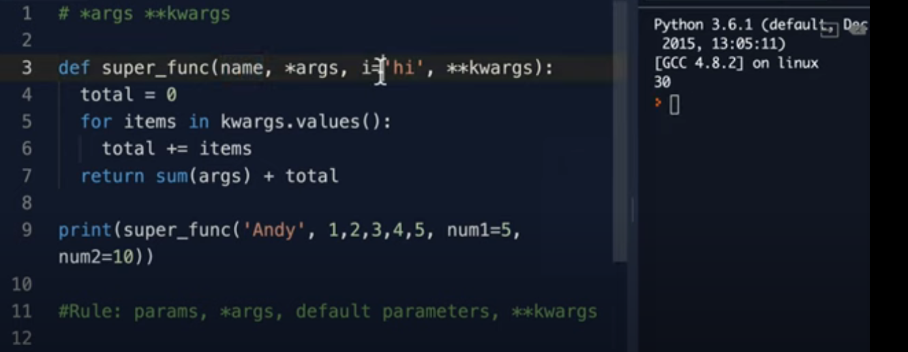


> 🟦🟦🟦🟦🟦🟦🟦🟦🟦🟦🟦🟦🟦🟦🟦🟦🟦🟦🟦🟦🟦🟦🟦🟦🟦🟦🟦🟦🟦🟦🟦🟦🟦🟦🟦🟦🟦🟦🟦🟦🟦🟦🟦🟦🟦🟦🟦🟦🟦🟦🟦🟦🟦🟦🟦🟦

# 🐍 Python Walrus Operator (:=)

The walrus operator, introduced in Python 3.8, allows assignment and usage of a variable within a single expression. It's formally called the assignment expression operator.

## 🔧 Syntax


```python
variable := expression
```


## ✅ Use Cases and Examples

### 1. while Loop

***🔁 Without Walrus:***


```python
line = input("Enter something: ")
while line != "quit":
    print(f"You entered: {line}")
    line = input("Enter something: ")

```

***✅ With Walrus:***

```python
while (line := input("Enter something: ")) != "quit":
    print(f"You entered: {line}")

```

### 2. if Statement

```python
if (length := len("hello world")) > 5:
    print(f"String is long: {length}")
```

### 3. List Comprehensions

```python
words = ["hi", "hello", "world", "a", "python"]
lengths = [length for word in words if (length := len(word)) > 3]
print(lengths)  # Output: [5, 5, 6]

```

## ⚠️ Notes
- The walrus operator does not replace the regular assignment =.

- It’s useful when you want to assign and use a value at once.

- Use it judiciously — overuse can harm code readability.


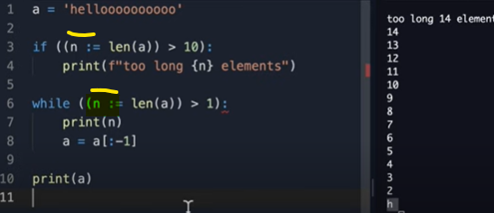

> 🟦🟦🟦🟦🟦🟦🟦🟦🟦🟦🟦🟦🟦🟦🟦🟦🟦🟦🟦🟦🟦🟦🟦🟦🟦🟦🟦🟦🟦🟦🟦🟦🟦🟦🟦🟦🟦🟦🟦🟦🟦🟦🟦🟦🟦🟦🟦🟦🟦🟦🟦🟦🟦🟦🟦🟦

# Scope: Understanding Variable Visibility

In Python, scope refers to the region of the code where a variable is recognized and accessible.

## 🔁 Types of Scope in Python: LEGB Rule

Python resolves variable names using the LEGB rule, which stands for:

| Scope Level   | Meaning                         | Example                             |
| ------------- | ------------------------------- | ----------------------------------- |
| **L**ocal     | Inside the current function     | Variables inside a function         |
| **E**nclosing | In enclosing functions (nested) | Outer function in a nested function |
| **G**lobal    | At the module level             | Top-level script or module          |
| **B**uilt-in  | Python’s built-in namespace     | `len`, `range`, etc.                |


## 🔍 Scope Types Explained

### 1. Local Scope
Defined inside a function. Accessible only within that function.


```python
def greet():
    message = "Hello"  # local variable
    print(message)

greet()
# print(message)  # ❌ NameError: message is not defined

```

### 2. Enclosing Scope (Nonlocal)
Applies to nested functions. Inner functions can access variables from the outer function using nonlocal.

```python
def outer():
    x = "outer"

    def inner():
        nonlocal x
        x = "modified"
        print(x)

    inner()
    print(x)  # modified

```
### 3. Global Scope
Defined outside any function. Can be accessed anywhere in the module using the global keyword to modify.


```python
count = 0  # global

def increment():
    global count
    count += 1

increment()
print(count)  # 1

```

### 4. Built-in Scope
Default names in Python (no need to define).


```python
print(len("hello"))  # len is a built-in function

```


## 🧪 Variable Lookup: LEGB in Action


```python
x = "global"

def outer():
    x = "enclosing"

    def inner():
        x = "local"
        print(x)  # local

    inner()

outer()

```

## ⚠️ Shadowing
Variables in an inner scope hide variables of the same name in outer scopes:


```python
x = 5

def func():
    x = 10  # shadows global x
    print(x)  # 10

func()
print(x)  # 5

```

## 📝 Summary Table


| Keyword    | Used For                | Affects Scope         |
| ---------- | ----------------------- | --------------------- |
| `global`   | Modify global variable  | Global scope          |
| `nonlocal` | Modify enclosing var    | Enclosing (non-local) |
| *(none)*   | Default inside function | Local scope           |


> 🟦🟦🟦🟦🟦🟦🟦🟦🟦🟦🟦🟦🟦🟦🟦🟦🟦🟦🟦🟦🟦🟦🟦🟦🟦🟦🟦🟦🟦🟦🟦🟦🟦🟦🟦🟦🟦🟦🟦🟦🟦🟦🟦🟦🟦🟦🟦🟦🟦🟦🟦🟦🟦🟦🟦🟦

# 🌐 Python global Keyword

The global keyword in Python is used to declare that a variable inside a function refers to a global variable — that is, a variable defined outside the function.

## 📌 Purpose
By default, variables assigned inside a function are local to that function.
To modify a global variable from within a function, you must use the global keyword.

***Example: Without global***


```python
x = 10  # Global variable

def update():
    x = x + 5  # ❌ UnboundLocalError
    print(x)

update()

```
***❌ This results in:***

```python
UnboundLocalError: local variable 'x' referenced before assignment

```

## ✅ Example: With global

```python
x = 10

def update():
    global x
    x = x + 5
    print(f"Updated x: {x}")

update()
print(f"Final x: {x}")

```

***✅ Output:***

```python
Updated x: 15
Final x: 15

```

##💡 When to Use global
- To modify a variable outside the current function.

- Useful when you want to retain changes across function calls.

##⚠️ When Not to Use global
- Avoid in large programs — it can make code harder to debug.

- Prefer function arguments/returns or class attributes when possible.

- Overuse can lead to tight coupling and side effects.


## 📝 Summary

| Feature       | Description                                     |
| ------------- | ----------------------------------------------- |
| Keyword       | `global`                                        |
| Use           | Modify global variable inside a function        |
| Default Scope | Assignments inside functions are **local**      |
| Best Practice | Use sparingly, prefer encapsulation if possible |


> 🟦🟦🟦🟦🟦🟦🟦🟦🟦🟦🟦🟦🟦🟦🟦🟦🟦🟦🟦🟦🟦🟦🟦🟦🟦🟦🟦🟦🟦🟦🟦🟦🟦🟦🟦🟦🟦🟦🟦🟦🟦🟦🟦🟦🟦🟦🟦🟦🟦🟦🟦🟦🟦🟦🟦🟦

# `Annotated` Type – Notes

## What is `Annotated`?

- `Annotated` is a type hint from the `typing` module (introduced in Python 3.9).
- It allows you to attach **metadata** (extra information) to type hints for function arguments and return values.


## Syntax

```python
from typing import Annotated

def function_name(
    arg1: Annotated[type, "description or metadata"]
) -> Annotated[return_type, "description"]:
    
```

**Example 1**

```python
from typing import Annotated

def add(
    a: Annotated[int, "First number"], 
    b: Annotated[int, "Second number"]
) -> Annotated[int, "Sum of a and b"]:
    return a + b

```

**Example 2**

```python
from typing import Annotated

def add_numbers(
    a: Annotated[int, "The first number"], 
    b: Annotated[int, "The second number"]
) -> Annotated[int, "The sum of the two numbers"]:
    return a + b

# Example usage:
result = add_numbers(3, 5)
print(result)  # Output: 8


# What’s happening?
# a: Annotated[int, "The first number"]

# a is an integer, with extra info saying “this is the first number”.

# b: Annotated[int, "The second number"]

# b is an integer, with extra info for documentation.

# The return value is also annotated to say, “this is the sum.”

```

## Does this change how the function works?
Nope!
The function runs just like a regular Python function. The annotations are mainly there for documentation, tools, or frameworks.

## Why Use Annotated?
Better Documentation:
Makes code self-explanatory by describing what each parameter and return value represents.

Framework Support:
Some libraries (e.g., Semantic Kernel, FastAPI, Pydantic) read these annotations to auto-generate documentation, forms, or help UIs.

No Runtime Effect:
The function behaves like normal Python code; annotations are for tools, IDEs, and documentation.


## When to Use
When building plugins, APIs, or frameworks where clarity and metadata help other tools or users understand your code.

When required or recommended by specific libraries.

## When NOT to Use
For simple scripts or projects where you don’t need extra descriptions.

If the framework or code reviewer doesn’t require it.

## Removing Annotated
If you use only regular type hints (e.g., a: int), you don’t need to import or use Annotated.

The code will still work the same way.

## Example: Without Annotated

```python
def add(a: int, b: int) -> int:
    return a + b

```

**Key Points**
- Annotated is optional; it’s an enhancement to normal type hints.

- Helps frameworks, tools, and humans understand function intent better.

- Always import from typing (for Python 3.9+) or typing_extensions (for Python 3.8).

## 🟢 Why Not Just Use # for Comments?

Comments (lines starting with #) are only visible in your code—they’re ignored by Python and not accessible to code analysis tools, documentation generators, or frameworks.


```python
def add(a: int, b: int) -> int:
    # a: The first number
    # b: The second number
    # returns: The sum
    return a + b

```

- This works for humans reading the code, but:
  - Tools can’t read these comments automatically.
  - No help for API documentation, UIs, or smart IDE features.


## 🟣 What Does Annotated Provide?
Annotated attaches metadata directly to the type hints of your function parameters and return values.

This metadata is part of the function’s “signature” and can be programmatically accessed at runtime or by frameworks.

```python
from typing import Annotated

def add(
    a: Annotated[int, "The first number"],
    b: Annotated[int, "The second number"]
) -> Annotated[int, "The sum"]:
    return a + b


```

- Now, libraries like Semantic Kernel, FastAPI, or Pydantic can read those descriptions and use them to:
  - Generate interactive documentation
  - Build UIs that prompt users for values
  - Create help messages or tooltips
  - Pass hints to LLMs for better plugin support


**🟢 In summary:**

| Approach    | For Humans? | For Tools & Frameworks? | Used in UI/docs? |
| ----------- | ----------- | ----------------------- | ---------------- |
| `# comment` | ✅           | ❌                       | ❌                |
| `Annotated` | ✅           | ✅                       | ✅                |


> 🟦🟦🟦🟦🟦🟦🟦🟦🟦🟦🟦🟦🟦🟦🟦🟦🟦🟦🟦🟦🟦🟦🟦🟦🟦🟦🟦🟦🟦🟦🟦🟦🟦🟦🟦🟦🟦🟦🟦🟦🟦🟦🟦🟦🟦🟦🟦🟦🟦🟦🟦🟦🟦🟦🟦🟦


> 🟦🟦🟦🟦🟦🟦🟦🟦🟦🟦🟦🟦🟦🟦🟦🟦🟦🟦🟦🟦🟦🟦🟦🟦🟦🟦🟦🟦🟦🟦🟦🟦🟦🟦🟦🟦🟦🟦🟦🟦🟦🟦🟦🟦🟦🟦🟦🟦🟦🟦🟦🟦🟦🟦🟦🟦


> 🟦🟦🟦🟦🟦🟦🟦🟦🟦🟦🟦🟦🟦🟦🟦🟦🟦🟦🟦🟦🟦🟦🟦🟦🟦🟦🟦🟦🟦🟦🟦🟦🟦🟦🟦🟦🟦🟦🟦🟦🟦🟦🟦🟦🟦🟦🟦🟦🟦🟦🟦🟦🟦🟦🟦🟦


```python


```

> 🟦🟦🟦🟦🟦🟦🟦🟦🟦🟦🟦🟦🟦🟦🟦🟦🟦🟦🟦🟦🟦🟦🟦🟦🟦🟦🟦🟦🟦🟦🟦🟦🟦🟦🟦🟦🟦🟦🟦🟦🟦🟦🟦🟦🟦🟦🟦🟦🟦🟦🟦🟦🟦🟦🟦🟦


> 🟦🟦🟦🟦🟦🟦🟦🟦🟦🟦🟦🟦🟦🟦🟦🟦🟦🟦🟦🟦🟦🟦🟦🟦🟦🟦🟦🟦🟦🟦🟦🟦🟦🟦🟦🟦🟦🟦🟦🟦🟦🟦🟦🟦🟦🟦🟦🟦🟦🟦🟦🟦🟦🟦🟦🟦


> 🟦🟦🟦🟦🟦🟦🟦🟦🟦🟦🟦🟦🟦🟦🟦🟦🟦🟦🟦🟦🟦🟦🟦🟦🟦🟦🟦🟦🟦🟦🟦🟦🟦🟦🟦🟦🟦🟦🟦🟦🟦🟦🟦🟦🟦🟦🟦🟦🟦🟦🟦🟦🟦🟦🟦🟦


> 🟦🟦🟦🟦🟦🟦🟦🟦🟦🟦🟦🟦🟦🟦🟦🟦🟦🟦🟦🟦🟦🟦🟦🟦🟦🟦🟦🟦🟦🟦🟦🟦🟦🟦🟦🟦🟦🟦🟦🟦🟦🟦🟦🟦🟦🟦🟦🟦🟦🟦🟦🟦🟦🟦🟦🟦


> 🟦🟦🟦🟦🟦🟦🟦🟦🟦🟦🟦🟦🟦🟦🟦🟦🟦🟦🟦🟦🟦🟦🟦🟦🟦🟦🟦🟦🟦🟦🟦🟦🟦🟦🟦🟦🟦🟦🟦🟦🟦🟦🟦🟦🟦🟦🟦🟦🟦🟦🟦🟦🟦🟦🟦🟦


